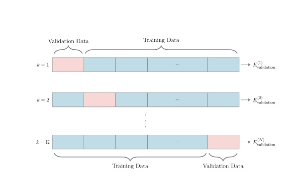
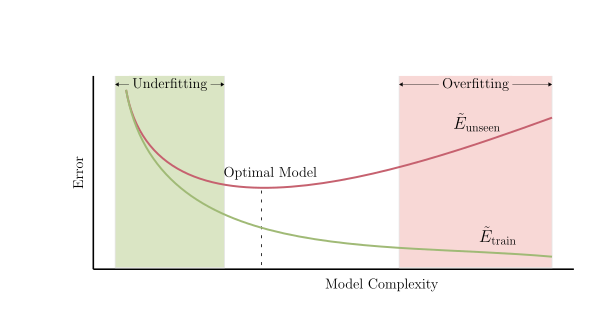
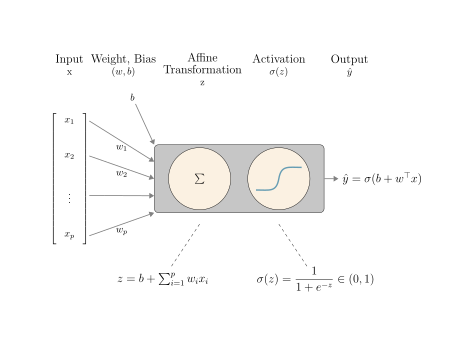
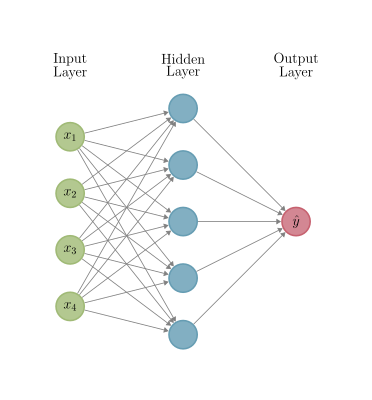
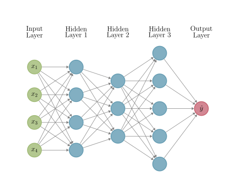
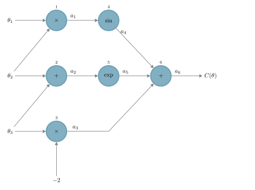
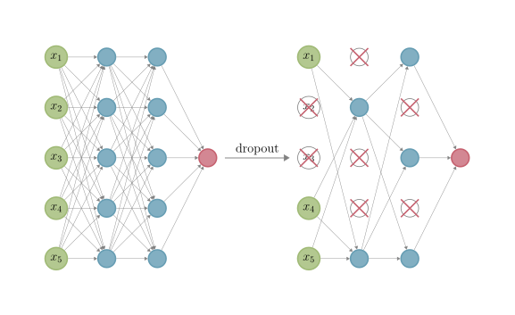

A walk from supervised learning and random forests through to neural
networks, optimisation, and the autodiff stack that PINNs sit on.
This unit follows the framing of *Mathematical Engineering of Deep
Learning* (Nazarathy & Klok), chapters 2–5, with code in Julia
(`MLJ.jl` for classical ML, `Lux.jl` for deep networks) and a
`scikit-learn` / `PyTorch` cameo so the cross-ecosystem story stays
alive.

A single unit can't cover everything — the goal here is *shared
vocabulary* and a feel for which classical ideas survive the journey
to PINNs. Deep-network theory and the modern PINN toolkit get their
own treatment in [Unit 7](../unit_07/unit_07.qmd).

## 2.1 Supervised learning fundamentals

### The setup

Given labelled data $\{(x_i, y_i)\}_{i=1}^N$, learn a function
$f: \mathbb{R}^n \to \mathcal{Y}$ such that $f(x) \approx y$ on
unseen inputs. The output space $\mathcal{Y}$ is continuous
(regression) or a finite set (classification). The art of supervised
learning is choosing a **function class** — linear, tree-based,
neural — and a **fitting procedure** that *generalises* beyond the
training set.

### Loss, true risk, empirical risk

A **loss** $\ell(\hat y, y)$ measures how bad a single prediction
is. The **true risk** is the population mean

$$R(f) = \mathbb{E}_{(x, y)\sim p}[\ell(f(x), y)].$$

We can't compute it, so we minimise the **empirical risk**

$$\hat R(f) = \frac{1}{N}\sum_{i=1}^N \ell(f(x_i), y_i).$$

All of supervised learning is a story about how, when, and *whether*
$\hat R$ approximates $R$. PINNs are no exception — their "data"
includes scattered collocation points where the loss is a PDE
residual rather than a label, but the ERM picture survives intact
([Unit 5](../unit_05/unit_05.qmd)).

### Train, validate, test — and $k$-fold cross-validation

The standard split: **training** to fit, **validation** to pick
hyperparameters, **test** to estimate true risk. Never let the test
set influence model choice.

When data is scarce, hold out one validation set at a time and
rotate. That's **$k$-fold cross-validation**:



### Bias, variance, and model complexity

Holding $N$ fixed and sweeping the function class from simple to
complex, training error decreases monotonically while test error is
$U$-shaped: too simple under-fits (high bias), too complex over-fits
(high variance). The minimum of the test-error curve marks the
"right" complexity for that dataset size.



For PINNs the same picture applies: the function class is set by the
network architecture, "complexity" is roughly the parameter count,
and the test set is replaced by held-out collocation points in the
PDE domain.

## 2.2 Random forests: a cross-language cameo

Before deep learning takes over, one quick stop on the
non-deep-learning side of the world.

### Decision trees, ensembled

A **decision tree** partitions the input space by axis-aligned
splits, with a constant prediction at each leaf. Greedy fitting
picks the split that reduces a loss criterion most at each node —
variance for regression, Gini or entropy for classification. Trees
are interpretable but **high-variance**: small data perturbations
produce wildly different trees.

A **random forest** mitigates the variance by averaging many trees
trained on bootstrap resamples of the data, with each split
considering only a random subset of features. The variance falls,
generalisation goes up, interpretability becomes harder to maintain.
Random forests are still a serious baseline on tabular problems —
often the right tool when you have hundreds-to-thousands of rows and
hand-designed features.

### Iris in Julia (`MLJ.jl`)

```{julia}
#| eval: false

using MLJ
using DataFrames

iris = load_iris()
y, X = unpack(iris, ==(:target); rng = 123)
X = DataFrame(X)

RandomForest = @load RandomForestClassifier pkg=DecisionTree verbosity=0
mach = machine(RandomForest(n_trees = 100), X, y)

evaluate!(mach, resampling = CV(nfolds = 5), measure = accuracy)
```

### Iris in Python (`scikit-learn`)

```python
from sklearn.datasets import load_iris
from sklearn.ensemble import RandomForestClassifier
from sklearn.model_selection import cross_val_score

iris = load_iris()
X, y = iris.data, iris.target

clf = RandomForestClassifier(n_estimators=100, random_state=123)
scores = cross_val_score(clf, X, y, cv=5, scoring="accuracy")
print(f"Accuracy: {scores.mean():.3f} ± {scores.std():.3f}")
```

The Python script runs as a sidecar — `./build.sh execute 2` writes
its captured output to `output/iris_rf.md`, included below:



Both report ≈ 0.96 mean accuracy. The point isn't the number; it's
that the same problem in two ecosystems has the **same shape** —
load data, choose a model, cross-validate, report. This template
recurs through the workshop.

### When classical ML wins

Random forests (and gradient boosting, and regularised linear
models) still beat neural networks when:

- the dataset is **small** (hundreds to thousands of rows),
- the features are **tabular and well-engineered**, or
- **interpretability** matters and you can pay the per-tree
  inspection cost.

Deep learning's edge sharpens with high-dimensional unstructured
inputs (images, text, audio), large datasets, and — as we'll see in
[Unit 5](../unit_05/unit_05.qmd) onwards — *PDE residuals*.

## 2.3 From logistic regression to a neural network

### Bernoulli likelihood and the sigmoid

For binary classification, model
$P(y = 1 \mid x) = \sigma(w^\top x + b)$ with the sigmoid
$\sigma(z) = 1/(1 + e^{-z})$. Maximising the Bernoulli likelihood
over training data is equivalent to minimising the **binary
cross-entropy**

$$\mathcal{L}(w, b) =
-\tfrac{1}{N}\sum_i \bigl[y_i \log \hat p_i + (1-y_i) \log (1-\hat p_i)\bigr],$$

where $\hat p_i = \sigma(w^\top x_i + b)$. That single-layer
$x \mapsto \sigma(w^\top x + b)$ is the simplest neural network — a
linear map followed by a smooth nonlinearity.

### Softmax for multiclass

Stack the binary case $K$ times and renormalise with the
**softmax**

$$\mathrm{softmax}(z)_k = \frac{e^{z_k}}{\sum_{j=1}^K e^{z_j}}.$$

The model becomes $P(y = k \mid x) = \mathrm{softmax}(Wx + b)_k$,
fit by **categorical cross-entropy**.



### Logistic regression in `Lux.jl`

```{julia}
#| eval: false

using Lux, Random

rng = Random.default_rng()
model = Lux.Chain(
    Lux.Dense(4 => 3),          # 4 iris features → 3 classes
    Lux.softmax,
)

ps, st = Lux.setup(rng, model)
ŷ, st = model(rand(rng, Float32, 4, 16), ps, st)  # forward pass on a batch
```

The `Lux.jl` style separates the *model* (a pure function) from
**parameters** `ps` and **state** `st` — the same explicit style
that lets `NeuralPDE.jl` compose layers with collocation losses in
[Unit 5](../unit_05/unit_05.qmd).

### A `scikit-learn` parallel

```python
from sklearn.linear_model import LogisticRegression
from sklearn.datasets import load_iris

iris = load_iris()
clf = LogisticRegression(max_iter=1000).fit(iris.data, iris.target)
print(clf.score(iris.data, iris.target))
```

Two lines of Python; one model in Julia. Both produce a softmax
classifier on iris. *What's different* is how the parameters are
exposed — implicit in `scikit-learn`, explicit in `Lux.jl` — and
that distinction matters once we start writing loss terms that need
gradients with respect to the parameters.

## 2.4 Feedforward networks

### MLPs: depth $\times$ width

A **multilayer perceptron (MLP)** stacks affine layers with
elementwise nonlinearities $\sigma$ in between:

$$f_\theta(x) = W_L\,\sigma\!\bigl(W_{L-1}\,\sigma(\cdots W_1 x + b_1 \cdots) + b_{L-1}\bigr) + b_L.$$

A one-hidden-layer network is enough to demonstrate the architecture
shape:



Depth lets the network compose features; width gives it room to
represent each:



### Universal approximation

A two-layer MLP with a non-polynomial activation can approximate any
continuous function on a compact set to arbitrary accuracy, given
enough hidden units ([Hornik, 1991](../references/references.qmd#ref-hornik1991){target="_blank"}; [Cybenko, 1989](../references/references.qmd#ref-cybenko1989){target="_blank"}). The theorem is
**qualitative**: it doesn't tell you how many units, how much data,
or how to train. Depth, architectural priors, and good optimisation
make the practical difference.

### Activation choices (with a PINN aside)

Common nonlinearities:

- **Sigmoid / tanh** — smooth, bounded, classical. Saturate, so deep
  networks gradient-vanish.
- **ReLU** $\max(0, x)$ — cheap, non-saturating, the modern default
  for vision / language tasks.
- **Swish** $x\,\sigma(\beta x)$ — smooth ReLU; good default for
  PINNs.

For **PINNs** the second derivatives matter (they show up in the
PDE residual). ReLU's second derivative is zero almost everywhere
— useless for diffusion-type PDEs. Smooth activations (tanh, Swish,
GELU) are the safe default; we use Swish throughout
[Units 5–7](../unit_05/unit_05.qmd).

## 2.5 Optimisation and autodiff

### Computational graphs and backprop

Every neural-network loss is the output of a finite computation
graph — a DAG whose nodes are tensors and whose edges are
elementary operations.



**Backpropagation** is exactly reverse-mode automatic
differentiation applied to that graph: one forward pass evaluates
intermediate quantities, one backward pass propagates gradients
using the chain rule. Cost is $O(\text{nodes})$ per gradient — i.e.,
similar to one forward pass.

### Optimisers: SGD, momentum, Adam, L-BFGS

Given gradients $g_t = \nabla_\theta \mathcal{L}(\theta_t)$, the
parameter update rules are:

- **SGD**: $\theta_{t+1} = \theta_t - \eta\, g_t$. Cheap, noisy,
  the default for large-batch deep learning.
- **SGD + momentum**: low-pass filter the gradients,
  $v_{t+1} = \mu v_t + g_t$, then step with $v_{t+1}$. Helps
  ravines and noisy gradients.
- **Adam** — adaptive per-parameter step sizes via running estimates
  of $\mathbb{E}[g]$ and $\mathbb{E}[g^2]$. The robust default for
  medium-scale deep learning.
- **L-BFGS** — quasi-Newton, no learning rate to tune; often the
  *best* choice for the small-batch low-noise regime PINNs inhabit.

Recipe for PINN training that recurs in [Units 5–7](../unit_05/unit_05.qmd):
**Adam** for a few thousand iterations to escape bad
initialisations, then **L-BFGS** for fine-tuning to a tight residual.

### Forward vs reverse mode (why PINNs need both)

For a function $f: \mathbb{R}^n \to \mathbb{R}^m$:

- **Forward mode** propagates derivatives along with values. Cost
  scales with $n$ (inputs).
- **Reverse mode** propagates derivatives backward. Cost scales with
  $m$ (outputs).

Standard deep learning is "many inputs, one scalar loss": $m = 1$,
reverse mode wins. *PINNs* are different: the loss involves
**spatial derivatives** of the network output evaluated at
collocation points. Those derivatives go into the loss, and the
final loss-gradient pass needs gradients of those *derivatives* —
a derivative of a derivative.

Computing this efficiently means **forward-over-reverse**:
forward-mode for the spatial derivative (one or two inputs),
reverse-mode for the outer gradient over parameters. Getting the
nesting right is what makes a PINN frame work; getting it wrong
makes training 100× slower. `Lux.jl` + `Zygote.jl` + `ForwardDiff.jl`
handle this composition cleanly, which is why the workshop uses
that stack.

## 2.6 Training a model in practice

A small iris classifier shows the full forward + loss + autodiff +
optimiser loop end-to-end — same dataset as the random forest in
§2.2 but with a deep model, so the comparison stays apples-to-apples.
The Lux version runs as a sidecar (`./build.sh execute 2`); the
PyTorch and `scikit-learn` blocks below are static, for the
cross-ecosystem comparison.

### `Lux.jl` MLP on iris

```{.julia filename="units/unit_02/scripts/iris_lux.jl" code-fold="true" code-summary="Show the Julia source"}

```

Captured output (after `./build.sh execute 2`):



### `scikit-learn` parallel

The same MLP architecture in `scikit-learn`'s `MLPClassifier`:

```{.python}
from sklearn.datasets import load_iris
from sklearn.neural_network import MLPClassifier
from sklearn.model_selection import cross_val_score

X, y = load_iris(return_X_y=True)
clf = MLPClassifier(
    hidden_layer_sizes=(16,), activation="tanh",
    solver="adam", max_iter=2000, random_state=123,
)
print(cross_val_score(clf, X, y, cv=5, scoring="accuracy").mean())
```

### `PyTorch` parallel

And the same model with explicit autodiff in `PyTorch`:

```{.python}
import torch, torch.nn as nn
from sklearn.datasets import load_iris
import numpy as np

X, y = load_iris(return_X_y=True)
X = torch.tensor(X, dtype=torch.float32)
y = torch.tensor(y, dtype=torch.long)

model = nn.Sequential(nn.Linear(4, 16), nn.Tanh(), nn.Linear(16, 3))
opt   = torch.optim.Adam(model.parameters(), lr=1e-2)
loss  = nn.CrossEntropyLoss()

for epoch in range(500):
    opt.zero_grad()
    L = loss(model(X), y)
    L.backward()
    opt.step()

preds = model(X).argmax(dim=1)
print(f"accuracy = {(preds == y).float().mean():.3f}")
```

All three follow the same skeleton — load data, define model, set
optimiser, loop minibatches, compute loss, step. The Julia version
makes the parameter state explicit; PyTorch and `scikit-learn` hide
it. The only meaningful differences are surface-level. Pick by
ecosystem.

### Regularisation, batch norm, dropout

Three standard knobs to keep training honest:

- **Weight regularisation** — add $\lambda \|\theta\|^2$ to the loss
  ($L_2$, "weight decay") to keep the parameters small.
- **Batch normalisation** — normalise activations within each
  mini-batch; lets you use higher learning rates and reduces
  sensitivity to initialisation.
- **Dropout** — randomly zero a fraction of activations during
  training; equivalent to averaging over an ensemble of thinned
  networks.



For PINNs the regularisation knobs you care about are *physics
terms* in the loss rather than weight penalties or dropout — the
PDE residual itself is a powerful regulariser, as we'll see from
[Unit 5](../unit_05/unit_05.qmd) onward.

## 2.7 What carries over to PINNs

Three ideas from this unit survive the journey to physics-informed
networks:

1. **Loss minimisation** as the unifying training principle. PINNs
   add residual terms to the loss but keep the empirical-risk
   skeleton.
2. **Generalisation** as the goal. A PINN that fits its collocation
   points but violates physics elsewhere is *overfitting*; held-out
   collocation samples play the role of the test set.
3. **Regularisation by physics**. The PDE residual is a domain
   prior — a regulariser sharper than any $L_2$ penalty, because
   it actually encodes what the function *must* satisfy.

With those in hand, [Unit 3](../unit_03/unit_03.qmd) lifts the
function-approximation idea into a SciML landscape, and
[Unit 4](../unit_04/unit_04.qmd) introduces the ODE side that PINNs
will meet head-on in [Unit 5](../unit_05/unit_05.qmd).
