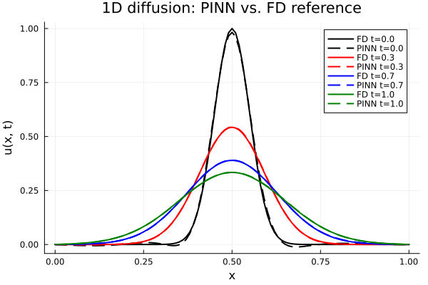

Our first hands-on PINN, in the simplest possible settings. We do
it **twice**:

1. **From first principles** — a one-page implementation in
   `Lux` + `Zygote` + `ForwardDiff` that you can read end-to-end.
   No PINN library, no symbolic machinery; just a network, a
   residual, and an optimiser. This is the inline code in §5.3.
2. **With `NeuralPDE.jl`** — the same problem written declaratively
   against a `ModelingToolkit` `PDESystem` and discretised in a
   single line. Concise, scalable, the right tool for the AIMS
   capstone — but harder to debug if you don't know the
   first-principles version first. This is the sidecar in §5.4.

Before the implementations, §5.2 is a focused autodiff deep-dive —
the forward/reverse/forward-over-forward composition that PINNs
depend on, in both Julia and JAX. We then push `NeuralPDE.jl` from
the ODE up to the simplest PDE (1D diffusion, §5.5) and call out
the failure modes that [Unit 7](../unit_07/unit_07.qmd) finally
fixes.

## 5.1 The PINN idea

### Residual loss from a differential equation

For an ODE $\dot{x} = f(x, t)$, define a network $x_\theta(t)$ —
input time, output state — and the **residual**

$$r_\theta(t) \;=\; \dot{x}_\theta(t) - f(x_\theta(t), t),$$

with $\dot{x}_\theta$ computed by autodiff *through the network*.
The **residual loss** is

$$\mathcal{L}_{\text{ODE}}(\theta) \;=\;
\frac{1}{N_r}\sum_{i=1}^{N_r} \bigl|r_\theta(t_i)\bigr|^2$$

evaluated at scattered **collocation points** $\{t_i\}$. Minimising
it pushes $x_\theta$ toward *a* solution of the ODE.

### Initial conditions are what pin it down

A residual alone has infinitely many solutions — the ODE is a one-
parameter family indexed by $x_0$. The IC term

$$\mathcal{L}_{\text{IC}}(\theta) \;=\; \bigl|x_\theta(0) - x_0\bigr|^2$$

(with weight $\lambda_{\text{IC}}$) selects the trajectory we want.
The same idea applies to boundary conditions on PDEs. The *weights*
$\lambda_{\text{IC}}, \lambda_{\text{BC}}, \lambda_{\text{PDE}}$ are
the main hyperparameter — tuning them well is a major theme of
[Unit 7](../unit_07/unit_07.qmd).

### Collocation points

Where do you put the $\{t_i\}$? Options:

- **Uniform grid** — simple, biased toward regular regions.
- **Random uniform** — eliminates grid bias.
- **Latin hypercube** — better space coverage in higher dimensions.
- **Adaptive** — sample more densely where the residual is high.

For a first pass on a smooth ODE, a uniform grid of a few hundred
points is plenty.

## 5.2 Autodiff for PINNs: forward, reverse, and second derivatives

[Unit 2 §2.5](../unit_02/unit_02.qmd#sec-optimisation-and-autodiff)
introduced forward vs reverse mode at the level of "scalar loss
gradient over parameters". PINNs need more than that. The residual
$r_\theta(x, t) = \partial_t u_\theta - \alpha\,\partial_{xx} u_\theta$
contains derivatives of the **network output with respect to the
inputs** $(x, t)$, and the *training* gradient needs the
parameter-gradient of that residual loss — a derivative of a
derivative. Getting the AD composition right is what makes a PINN
train in seconds rather than minutes (or not at all). This section
walks the four AD operations PINNs actually need, side-by-side in
Julia (`ForwardDiff` / `Zygote` / `Enzyme`) and JAX
(`jax.grad` / `jax.jacfwd` / `jax.hessian`).

### Three derivatives, three modes

For a network $u_\theta(\mathbf{x}, t): \mathbb{R}^{d+1} \to \mathbb{R}$
with $P$ parameters, three derivative computations recur:

| What | Shape | Right mode |
|---|---|---|
| $\partial u_\theta / \partial x_i$ at one $(\mathbf{x}, t)$ | $\mathbb{R}^{d+1} \to \mathbb{R}$ | **forward** (cheap inputs) |
| $\partial^2 u_\theta / \partial x_i^2$ at one $(\mathbf{x}, t)$ | scalar | **forward-over-forward** |
| $\partial \mathcal{L} / \partial \theta$ over all $\theta$ | $\mathbb{R}^P \to \mathbb{R}$ | **reverse** (cheap output) |

The composition that trains a PINN is therefore
**reverse-over-(forward-over-forward)**: forward for the
$\partial_x$, forward again for the $\partial_{xx}$, reverse on
the outside for $\partial_\theta \mathcal{L}$. Every PINN
framework — Julia's `Lux + ForwardDiff + Zygote`, JAX's `flax + jax.grad`,
PyTorch's `torch.autograd.grad` — implements exactly this stack.

### Forward mode: spatial derivatives of the network

In Julia, `ForwardDiff.derivative` is the workhorse for scalar
inputs:

```{.julia}
using Lux, Random, ForwardDiff

rng = Random.MersenneTwister(0)
u = Lux.Chain(Lux.Dense(2 => 16, tanh), Lux.Dense(16 => 1))
ps, st = Lux.setup(rng, u)

u_θ(x, t) = first(u([x, t], ps, st)[1])

# ∂u/∂x via forward mode
∂x(x, t) = ForwardDiff.derivative(ξ -> u_θ(ξ, t), x)
@info "∂u/∂x at (0.3, 0.5) = $(∂x(0.3, 0.5))"
```

The JAX equivalent — `jax.jacfwd` is the multi-input forward-mode
Jacobian, but for a scalar input the single-derivative `jax.grad`
composed in forward-mode style is equivalent:

```{.python}
import jax, jax.numpy as jnp
from flax import linen as nn

class MLP(nn.Module):
    @nn.compact
    def __call__(self, xt):
        h = nn.tanh(nn.Dense(16)(xt))
        return nn.Dense(1)(h).squeeze()

mlp = MLP()
key = jax.random.PRNGKey(0)
params = mlp.init(key, jnp.zeros(2))

u_theta = lambda x, t: mlp.apply(params, jnp.array([x, t]))
du_dx   = jax.jacfwd(u_theta, argnums=0)        # ∂u/∂x, forward mode
print("∂u/∂x at (0.3, 0.5) =", du_dx(0.3, 0.5))
```

### Second derivatives: the PDE residual

For the heat equation we need $\partial^2_x u_\theta$. The
cleanest composition is **forward-over-forward**: differentiate
once with `ForwardDiff`, then differentiate the result *again*
with `ForwardDiff`. The dual-number machinery handles the nesting
automatically:

```{.julia}
# ∂²u/∂x² via forward-over-forward
∂xx(x, t) = ForwardDiff.derivative(
                ξ -> ForwardDiff.derivative(η -> u_θ(η, t), ξ),
                x,
            )
@info "∂²u/∂x² at (0.3, 0.5) = $(∂xx(0.3, 0.5))"

# Residual of the heat equation ∂_t u = α ∂_xx u
α = 0.1
∂t(x, t) = ForwardDiff.derivative(τ -> u_θ(x, τ), t)
r(x, t)  = ∂t(x, t) - α * ∂xx(x, t)
@info "heat-eq residual at (0.3, 0.5) = $(r(0.3, 0.5))"
```

In JAX the analogous pattern — `jax.hessian` is `jacfwd ∘ jacrev`
under the hood, exactly the right composition:

```{.python}
import jax

# ∂²u/∂x² at fixed t
d2u_dx2 = jax.jacfwd(jax.jacfwd(u_theta, argnums=0), argnums=0)
du_dt   = jax.jacfwd(u_theta, argnums=1)

alpha = 0.1
def residual(x, t):
    return du_dt(x, t) - alpha * d2u_dx2(x, t)

print("heat-eq residual at (0.3, 0.5) =", residual(0.3, 0.5))
```

For higher-dimensional inputs (say a 3-D wave equation needing
$\partial^2_x + \partial^2_y + \partial^2_z$), `jax.hessian(u_theta)`
returns the full $3 \times 3$ Hessian at a point — take its trace
to get the Laplacian.

### The outer gradient: reverse mode over parameters

The residual at a collocation point is a scalar; the *loss* sums
many of them, then we want $\partial_\theta \mathcal{L}$ — a single
output, $P$ inputs. Classic reverse-mode territory: `Zygote.gradient`
in Julia, `jax.grad` in JAX. The two AD modes happily compose.

```{.julia}
function pde_loss(ps, st, xs, ts)
    ŝ = 0.0
    for (x, t) in zip(xs, ts)
        u_θ(x, t) = first(u([x, t], ps, st)[1])
        ∂t = ForwardDiff.derivative(τ -> u_θ(x, τ), t)
        ∂xx = ForwardDiff.derivative(
                  ξ -> ForwardDiff.derivative(η -> u_θ(η, t), ξ), x)
        ŝ += (∂t - α * ∂xx)^2
    end
    ŝ / length(xs)
end

# Reverse-mode autodiff over θ, with forward-over-forward inside
grad = first(Zygote.gradient(p -> pde_loss(p, st, xs, ts), ps))
```

The same shape in JAX is breathtakingly compact:

```{.python}
def loss(params, xs, ts):
    def r_single(x, t):
        u   = lambda x, t: mlp.apply(params, jnp.array([x, t]))
        d2  = jax.jacfwd(jax.jacfwd(u, argnums=0), argnums=0)
        dt  = jax.jacfwd(u, argnums=1)
        return (dt(x, t) - alpha * d2(x, t)) ** 2
    return jnp.mean(jax.vmap(r_single)(xs, ts))

grad_fn = jax.grad(loss)             # reverse-mode over params
```

### Why nesting order matters

A practical pitfall: **don't use reverse mode for the *inner*
derivatives**. Reverse-mode AD records a tape proportional to the
size of the network's intermediate activations; nesting two reverse
passes through the same network multiplies the tape size. On a
modest 5-layer MLP this can turn a 100 ms step into a 20-second
step. Forward mode's cost scales with the *input dimension*, so for
PDEs in 1D / 2D / 3D — exactly the regime PINNs operate in —
forward-over-forward is the right choice for the spatial pieces.

The general rule (true in both Julia and JAX):

> **Inner derivatives over the few-dimensional input → forward
> mode. Outer derivative over the many-dimensional parameter
> vector → reverse mode.**

That single rule of thumb is what makes the `Lux + ForwardDiff +
Zygote` stack work, and it's also what `NeuralPDE.jl` and JAX's
`Lineax` / `optax` glue together for you. Get the composition
right and PINN training scales; get it wrong and it doesn't.

### Connecting back to Unit 1

The forward solver for the shallow-water equations in
[Unit 1](../unit_01/unit_01.qmd) computed $\partial^2 \eta /
\partial t^2$ by *finite differences*, on a 100×190 grid, in
$\sim 12\,\text{s}$. The PINN above computes the *same kind of
second derivative* — but at arbitrary $(x, y, t)$ points, with
exact (rounding error only) accuracy, on demand from the network.
That is the headline trade-off PINNs offer: you give up the
structured-grid efficiency of FD/FV/FEM and you get a meshless,
autodiff-exact, easily-differentiable surrogate in return. The
rest of [Units 5–7](../unit_05/unit_05.qmd) is mostly about how to
realise that trade in practice.

## 5.3 A PINN from first principles

We solve $\dot{x}(t) = -x(t)$ with $x(0) = 1$ — the simplest
non-trivial ODE — whose exact solution is $x(t) = e^{-t}$. Our PINN
will be a 1 → 16 → 1 MLP with $\tanh$ activations. The three pieces
of machinery are exactly what §5.2 motivated:

- `Lux` for the model and its parameter container;
- `ForwardDiff.derivative` to compute $\dot{x}_\theta(t)$ at
  collocation points (scalar input → forward mode);
- `Zygote.gradient` to differentiate the *loss* with respect to
  $\theta$ (many-input scalar-output → reverse mode). The
  composition is forward-over-reverse.

```{julia}
using Lux, Random, Zygote, ForwardDiff, Optimisers, Plots

rng = Random.MersenneTwister(0)
model = Lux.Chain(
    Lux.Dense(1 => 16, tanh),
    Lux.Dense(16 => 1),
)
ps, st = Lux.setup(rng, model)

# scalar t → scalar x_θ(t)
function x_θ(t, ps, st)
    y, _ = model([t], ps, st)
    y[1]
end

# autodiff time derivative through the network (forward mode)
dxdt(t, ps, st) = ForwardDiff.derivative(τ -> x_θ(τ, ps, st), t)

ts = collect(range(0.0, 4.0; length = 64))   # collocation points

function loss(ps)
    L_res = sum(t -> (dxdt(t, ps, st) + x_θ(t, ps, st))^2, ts) / length(ts)
    L_ic  = (x_θ(0.0, ps, st) - 1.0)^2
    L_res + 100.0 * L_ic
end

opt_state = Optimisers.setup(Optimisers.Adam(2e-2), ps)
for epoch in 1:1500
    g = first(Zygote.gradient(loss, ps))
    opt_state, ps = Optimisers.update(opt_state, ps, g)
end

# compare to the exact solution
tgrid  = range(0.0, 4.0; length = 200)
exact  = exp.(-collect(tgrid))
learnt = [x_θ(t, ps, st) for t in tgrid]

plt = plot(tgrid, exact;  label = "exact e^(-t)",
           xlabel = "t", ylabel = "x", lw = 2)
plot!(plt, tgrid, learnt; label = "PINN", lw = 2, ls = :dash)
```

Notice what this is, and what it isn't:

- There is **no time-stepping**. The PINN doesn't march forward in
  time; it fits a function on the whole interval at once.
- There is **no training data** — only the equation and the IC. The
  collocation points are *unlabelled*.
- The loss is **differentiable** because $\dot{x}_\theta$ is
  computed by AD; if you could write the residual you can train.

That last point is the whole game. Whatever differential equation
you can encode as a residual `r(t, ps)`, the same loop trains a PINN
for it. The difficulty in §§5.3-5.4 is *scaling* the bookkeeping:
multiple BCs, multiple spatial dimensions, multiple loss terms.
That's what `NeuralPDE.jl` automates.

## 5.4 The same ODE with `NeuralPDE.jl`

`NeuralPDE.jl` turns a `ModelingToolkit.PDESystem` (equation +
domains + BCs) and a `PhysicsInformedNN(chain, training_strategy)`
discretisation into an `OptimizationProblem` that any `Optimization.jl`
optimiser can solve. The same $\dot{x} = -x$ problem becomes:

```{.julia code-fold="true" code-summary="`scripts/pinn_neuralpde_ode.jl` — full source"}

```

Captured output from `./build.sh execute 5`:



What the package buys you: a one-line residual derivation (no
hand-rolled `dxdt`), built-in collocation strategies, and a clean
path from `Optimization.solve` to `Adam`, `LBFGS`, or any other
adapter in the SciML stack. What you pay: heavier precompile and a
*lot* of symbolic machinery between your problem and the gradient
that ends up training the network.

## 5.5 The simplest PDE: 1D diffusion

The 1D heat equation
$\partial_t u = \alpha\,\partial_x^2 u$ on $(x, t) \in [0, 1]\times[0, 1]$
with Dirichlet boundaries $u(0, t) = u(1, t) = 0$ and a Gaussian
initial bump $u(x, 0) = \exp\!\bigl(-200(x - 0.5)^2\bigr)$. Parabolic,
smoothing, well-posed — and the first proper PDE PINN benchmark.

The implementation is structurally identical to §5.4, with one
extra spatial coordinate and one extra BC pair:

```{.julia code-fold="true" code-summary="`scripts/pinn_neuralpde_heat.jl` — full source"}

```

Captured output from `./build.sh execute 5`:





## 5.6 Failure modes already visible

Even on benign problems three pathologies show up that motivate
everything in [Unit 7](../unit_07/unit_07.qmd):

- **Spectral bias.** MLPs with smooth activations preferentially fit
  low frequencies first ([Rahaman et al., 2019](../references/references.qmd#ref-rahaman2019){target="_blank"}). The Gaussian initial
  bump in §5.5 — locally high curvature — is the slowest-converging
  feature of the loss.
- **Loss imbalance.** With residual, IC, and BC contributing terms
  of very different magnitude, the optimiser zeroes the easiest one
  first. The PINN can land on a solution that satisfies the equation
  inside the domain but ignores the boundary, or fits the IC and the
  PDE while drifting at the BC.
- **Causal violation.** A time-dependent PINN can fit the residual at
  every $t$ simultaneously, including futures whose dependence on the
  IC hasn't propagated forward. The result is locally consistent at
  each $(x, t)$ point but globally inconsistent as a *trajectory*.

These three are the meat of [Unit 7](../unit_07/unit_07.qmd):
adaptive loss weighting, Fourier feature embeddings, hard BC
enforcement, and causal training. With those tools we can train
PINNs on the capstone column in [Unit 9 / Unit 10](../unit_09/unit_09.qmd);
without them we can't.
