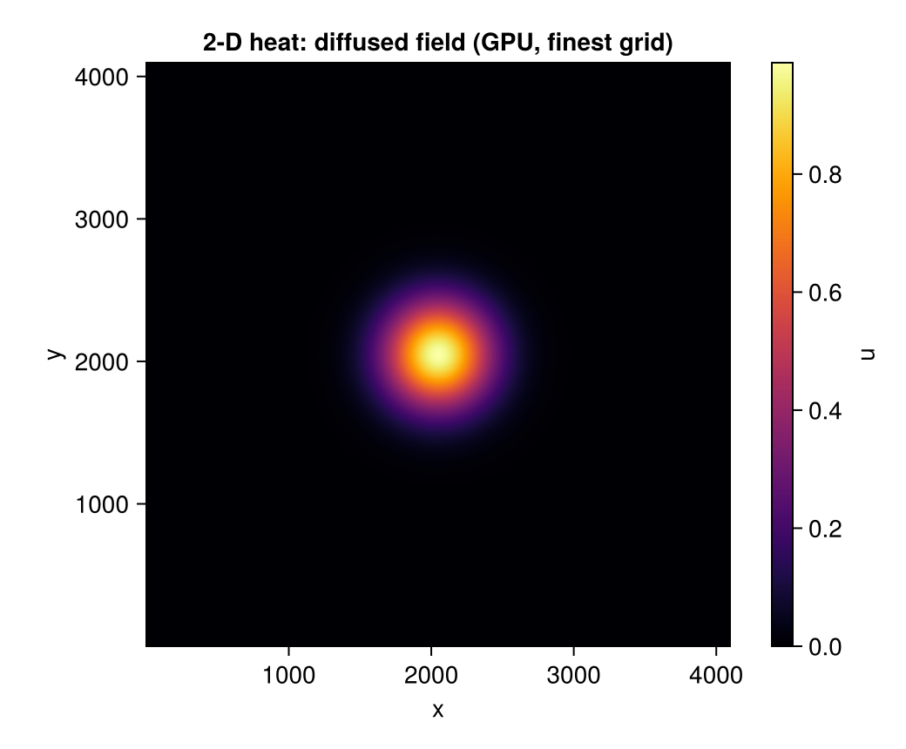

Formal foundations of PDEs: classification (elliptic, parabolic,
hyperbolic), boundary and initial conditions, well-posedness. The
three canonical mechanisms — diffusion, advection, reaction — appear
as the building blocks for everything that follows. The unit closes
with finite-difference numerics and the linearised shallow water
equations as a worked nonlinear example we revisit in the capstone.

## 6.1 PDE Classification and Well-Posedness

We work in physical space-time throughout. Spatial coordinates are
$x, y, z$; time is $t$. The unknown $u(x, y, z, t)$ stands in for
whatever physical field a given equation models — temperature,
pressure, concentration, displacement, electric potential. The
Laplacian is

$$\nabla^2 u = \frac{\partial^2 u}{\partial x^2}
            + \frac{\partial^2 u}{\partial y^2}
            + \frac{\partial^2 u}{\partial z^2};$$

in 1D it reduces to $u_{xx}$, in 2D to $u_{xx} + u_{yy}$. Vector fields
(velocity $\mathbf{u}(x, y, z, t)$, etc.) appear in the systems at the
bottom of the table below.

### Common PDE Models at a Glance

A map of the PDEs we'll meet, grouped by character. Most of classical
physics lives in this table; the rest of the unit is about how to read,
classify, and solve them.

| Name | Equation | Type | Typical application |
|------|----------|------|---------------------|
| **Laplace** | $\nabla^2 u = 0$ | Elliptic | Steady-state temperature, electrostatic potential |
| **Poisson** | $\nabla^2 u = f$ | Elliptic | Potential with sources (gravity, charge) |
| **Helmholtz** | $\nabla^2 u + k^2 u = 0$ | Elliptic | Standing waves, frequency-domain wave problems |
| **Heat / diffusion** | $u_t = \alpha\,\nabla^2 u$ | Parabolic | Heat conduction, mass diffusion |
| **Reaction–diffusion** | $u_t = \alpha\,\nabla^2 u + f(u)$ | Parabolic (nonlinear) | Pattern formation, population dynamics |
| **Advection** | $u_t + c\,\partial_x u = 0$ | Hyperbolic (1st order) | Pure transport in a flow |
| **Wave** | $u_{tt} = c^2\,\nabla^2 u$ | Hyperbolic | Vibrations, sound, electromagnetic waves |
| **Advection–diffusion** | $u_t + c\,\partial_x u = \alpha\,u_{xx}$ | Mixed (parabolic + 1st-order hyperbolic) | Pollutant or heat in a flow |
| **Burgers** | $u_t + u\,u_x = \nu\,u_{xx}$ | Nonlinear | Shock formation; simple fluid model |
| **Shallow water** | $\eta_t + H\,\nabla\!\cdot\!\mathbf{u} = 0,\;\;\mathbf{u}_t + g\,\nabla\eta = 0$ | Hyperbolic system | Ocean and atmospheric flow (revisited in §6.8) |

### Order, Linearity, and Type

A **partial differential equation (PDE)** is a relationship between an
unknown function of several variables and its partial derivatives. In
general form,

$$F\!\left(x_1, \ldots, x_n,\, u,\,
\frac{\partial u}{\partial x_1}, \ldots,
\frac{\partial^2 u}{\partial x_1^2}, \ldots\right) = 0.$$

The **order** of a PDE is the highest derivative that appears. We
focus on second-order PDEs in two variables — they cover most of the
physics relevant to PINNs.

### Elliptic, Parabolic, Hyperbolic

The general second-order linear PDE in two variables takes the form

$$a\,u_{xx} + 2b\,u_{xy} + c\,u_{yy} + \text{lower-order terms} = 0,$$

with coefficients that may depend on position. The character of
solutions depends entirely on the **discriminant** $\Delta = b^2 - ac$:

| Type | Condition | Behaviour | Canonical example |
|------|-----------|-----------|-------------------|
| **Elliptic** | $b^2 - ac < 0$ | Steady-state, smooth | Laplace: $u_{xx} + u_{yy} = 0$ |
| **Parabolic** | $b^2 - ac = 0$ | Diffusion, smoothing | Heat: $u_t = \alpha\,u_{xx}$ |
| **Hyperbolic** | $b^2 - ac > 0$ | Wave propagation | Wave: $u_{tt} = c^2\,u_{xx}$ |

Classification matters because it determines what boundary/initial
conditions are needed for well-posedness, how information propagates,
and which numerical methods are appropriate.

### Boundary and Initial Conditions

The four common boundary-condition types:

- **Dirichlet**: prescribe the value of $u$ on the boundary
  ("the wall is held at temperature $T_{\text{wall}}$").
- **Neumann**: prescribe the *normal derivative* $\partial_n u$
  ("heat flux through the wall is $q$").
- **Robin** (mixed): a linear combination
  $\alpha u + \beta\,\partial_n u = g$. Common when the boundary
  exchanges with an external medium.
- **Periodic**: $u(x_{\text{left}}) = u(x_{\text{right}})$ — used
  to model infinite domains by tiling.

For time-dependent problems, an **initial condition**
$u(\mathbf{x}, 0) = u_0(\mathbf{x})$ fixes the state at $t = 0$.
Parabolic and hyperbolic PDEs need ICs; elliptic problems do not
(they're steady-state).

### Well-Posedness

Hadamard's three criteria. A problem is **well-posed** if (1) a
solution exists, (2) it is unique, (3) it depends continuously on
the data (initial conditions, boundary conditions, source terms).
Mismatching boundary conditions to PDE type produces ill-posed
problems — for example, prescribing both $u$ and $\partial_n u$ on
the same boundary of an elliptic equation generally has no solution.
PINNs inherit this constraint: an ill-posed problem will train to a
residual minimum that is not the (non-existent) classical solution.

### Strong and weak solutions

A **strong** (or *classical*) solution of a PDE has *as many
classical derivatives as the equation needs*, and satisfies the
equation *pointwise* at every point of the domain. The heat
equation $u_t = \alpha u_{xx}$ needs $u_t$ and $u_{xx}$ to exist
and be continuous; if you have a $u$ in $C^{2,1}$ that satisfies
the equation at every $(x, t)$, that's a strong solution.

Most physical PDEs don't admit strong solutions in general. As
soon as you have shocks (Burgers, the compressible Euler
equations), corners in the domain (an L-shaped boundary for
Laplace), or rough initial data (a step function for the heat
equation), the requisite pointwise derivatives don't exist
everywhere. The way out is to relax what "solving" means.

A **weak** (or *generalised*) solution satisfies the PDE
*on average against every test function*. Concretely, multiply
$u_t = \alpha u_{xx}$ by a smooth compactly-supported test
function $v(x, t)$, integrate by parts to push the spatial
derivative onto $v$, and demand the resulting integral identity
holds for every $v$:

$$
\int_\Omega \int_0^T u\, v_t \, dt\, dx
\;=\;
\alpha \int_\Omega \int_0^T u_x\, v_x \, dt\, dx
\qquad \forall v.
$$

A weak solution only needs $u$ to have *one* spatial derivative
in an $L^2$ sense — much weaker than $C^{2}$. Any strong
solution is automatically a weak one; the reverse is not true.

Why this matters here:

- The **finite-element method** (§6.6) is built directly on the
  weak form — it discretises the integral identity, not the
  pointwise PDE.
- **PINNs** sit somewhere in between. They enforce the residual
  *pointwise* at collocation points (strong-form-ish), but the
  loss aggregates over many points, which behaves like a weak
  form. This is one reason PINNs handle moderately rough
  solutions better than naive finite differences but still
  struggle with genuine shocks.

We won't develop the weak / Sobolev theory rigorously — that's a
graduate course in itself. But the distinction is worth knowing
about every time someone tells you "this PDE has a solution":
*in what sense?*

::: {#ex-6-1 .callout-note .section-exercise icon="false" collapse="true"}
## ✏️ Section exercise — classify, then prescribe

Pencil-and-paper drill. For each PDE below, compute the discriminant
$b^2 - ac$, classify it (elliptic / parabolic / hyperbolic), and
state which conditions a well-posed problem needs (IC? BC? both?):

1. $u_{xx} + 4\,u_{yy} = 0$
2. $u_{xx} - 4\,u_{tt} = 0$ (treat $t$ as the second variable)
3. $u_t = 3\,u_{xx}$
4. $u_{xx} + 2\,u_{xy} + u_{yy} = 0$
5. $y\,u_{xx} + u_{yy} = 0$ (the Tricomi equation — careful, the
   answer depends on where you are in the plane)

Finish with the well-posedness traps: why does prescribing both $u$
and $\partial_n u$ on the same boundary of a Laplace problem
generally fail, and why is the *backward* heat equation
($u_t = -\alpha u_{xx}$ forward in time) hopeless even with perfect
data?

::: {.exercise-hint tabindex="0"}
💡 Hint

::: {.exercise-hint-text}
Careful with the cross-term convention: the general form has $2b\,u_{xy}$, so equation 4's coefficient 2 means $b = 1$. For Tricomi, the discriminant inherits the sign of $-y$. The two traps both reduce to Hadamard's third criterion — perturb the data at spatial frequency $k$ and watch what the solution does.
:::
:::

::: {.exercise-solution-link}
[Go to solution →](../exercise_solutions/exercise_solutions.qmd#sol-6-1)
:::
:::

## 6.2 Explicit Solution Techniques

Before we approximate a PDE numerically (let alone with a neural
network), it pays to know which problems admit a **closed-form
solution** and how those solutions are derived. The classical
techniques aren't museum pieces: they're the source of the
*correct answers* against which every numerical scheme — finite
differences, finite volumes, finite elements, PINNs — is
benchmarked. The next three subsubsections walk the three main
tools: **separation of variables**, **Fourier series**, and
**Laplace transforms**. Each is presented at a level that yields
one concrete worked solution.

### Separation of variables: heat equation on a rod

The cleanest example. Take the heat equation on a finite rod of
length $L$ with both ends held at zero:

$$
u_t \;=\; \alpha\, u_{xx},
\qquad 0 < x < L,\ t > 0,
$$

with Dirichlet boundaries $u(0, t) = u(L, t) = 0$ and initial
profile $u(x, 0) = f(x)$.

**Step 1 — assume a separated form** $u(x, t) = X(x)\,T(t)$.
Substitute:

$$
X(x)\,T'(t) = \alpha\, X''(x)\, T(t)
\quad\Longleftrightarrow\quad
\frac{T'(t)}{\alpha\, T(t)} = \frac{X''(x)}{X(x)} = -\lambda,
$$

where the constant $-\lambda$ (the **separation constant**) must
hold because the left side depends only on $t$, the right only on
$x$.

**Step 2 — solve each ODE.** The spatial eigenproblem
$X'' + \lambda X = 0$ with $X(0) = X(L) = 0$ has solutions only
when $\lambda = \lambda_n = (n\pi/L)^2$ for $n = 1, 2, 3, \ldots$,
namely $X_n(x) = \sin(n\pi x / L)$. The time equation
$T' = -\alpha\lambda_n T$ has $T_n(t) = e^{-\alpha\lambda_n t}$.

**Step 3 — superpose**. Linearity of the PDE means any sum
$u(x, t) = \sum_{n=1}^{\infty} b_n \sin(n\pi x/L)\, e^{-\alpha (n\pi/L)^2 t}$
is also a solution. The initial condition fixes the coefficients:

$$
f(x) \;=\; \sum_{n=1}^{\infty} b_n \sin(n\pi x / L)
\qquad\Longrightarrow\qquad
b_n \;=\; \frac{2}{L}\int_0^L f(x)\,\sin(n\pi x / L)\, dx.
$$

The complete solution is

$$
\boxed{\;
u(x, t) \;=\; \sum_{n=1}^{\infty} b_n\, e^{-\alpha (n\pi/L)^2 t}\, \sin\!\bigl(n\pi x / L\bigr).
\;}
$$

Three observations that recur all the way through the rest of the
course:

1. **High-frequency modes decay fastest.** The mode $n$ decays
   like $e^{-\alpha n^2 \pi^2 t / L^2}$ — a factor of $n^2$ in
   the exponent. This is why diffusion *smooths*: sharp features
   (high $n$) die quickly; the long-wavelength shape survives. It
   is also why MLP-PINNs ([Unit 5 §5.6](../unit_05/unit_05.qmd))
   struggle to fit sharp initial data — the loss surface is
   dominated by the slow low-frequency modes (a different reason,
   but a related one called **spectral bias**).
2. **Linearity of the PDE → superposition of eigenmodes.**
   Nonlinear PDEs (Burgers, Navier–Stokes, the full shallow-water
   equations) don't admit this decomposition. That's the
   structural reason they're harder.
3. **The eigenmodes are determined by the boundary conditions.**
   Dirichlet boundaries gave us $\sin(n\pi x / L)$. Neumann
   boundaries would give $\cos$; periodic would give complex
   exponentials. Everything downstream cascades from the BC choice.

### Fourier series: the eigenmode toolbox

The expansion $f(x) = \sum_n b_n \sin(n\pi x / L)$ from Step 3 is
a **Fourier sine series**. More generally, a function on
$[-L, L]$ has a full Fourier series

$$
f(x) \;=\; \frac{a_0}{2}
       + \sum_{n=1}^{\infty}\Bigl[a_n \cos\!\bigl(n\pi x / L\bigr)
                                   + b_n \sin\!\bigl(n\pi x / L\bigr)\Bigr],
\qquad
\begin{aligned}
a_n &= \tfrac{1}{L} \int_{-L}^{L} f(x)\cos(n\pi x/L)\, dx, \\
b_n &= \tfrac{1}{L} \int_{-L}^{L} f(x)\sin(n\pi x/L)\, dx.
\end{aligned}
$$

The Fourier coefficients are the *coordinates* of $f$ in the
orthonormal basis of trig functions — the same way you'd write a
vector in $\mathbb{R}^n$ in terms of basis vectors. Three uses
that turn up across the rest of the workshop:

- **Solve linear PDEs by mode-by-mode evolution.** Take the
  Fourier transform of the initial condition, multiply each mode
  by its time-dependent factor (exponential decay for heat,
  sinusoidal oscillation for wave), then inverse-transform. This
  is the basis of **spectral methods**.
- **Diagnose numerical schemes.** Von Neumann stability analysis
  (covered in §6.4) studies how an FD scheme amplifies *each
  Fourier mode*. The CFL condition falls out automatically.
- **Diagnose PINN failure modes.** The "spectral bias" of MLPs
  (slow learning of high-frequency components, Rahaman et al.
  2019) and the Fourier-feature embedding fix
  ([Tancik et al. 2020](../references/references.qmd#ref-tancik2020){target="_blank"};
  details in [Unit 7](../unit_07/unit_07.qmd)) are stated and
  understood in the Fourier basis.

### Laplace transforms: turning ODEs into algebra

For initial-value problems (parabolic and hyperbolic PDEs in time),
the **Laplace transform** $\mathcal{L}\{f(t)\}(s) = \int_0^\infty f(t)\,e^{-st}\, dt$
converts time derivatives into multiplication:

$$
\mathcal{L}\{f'(t)\}(s) \;=\; s\,F(s) - f(0),
\qquad
\mathcal{L}\{f''(t)\}(s) \;=\; s^2\,F(s) - s\, f(0) - f'(0).
$$

Apply it to a PDE in $t$ and you get an *ODE* in the remaining
spatial variables, parameterised by $s$. Solve the spatial ODE,
inverse-transform back to $t$.

The canonical worked example is the 1-D heat equation on the
half-line $x > 0$ with a suddenly imposed boundary temperature
$u(0, t) = u_0$ and $u(x, 0) = 0$. Laplace-transforming in $t$:

$$
s\, U(x, s) \;=\; \alpha\, U_{xx}(x, s),
\quad
U(0, s) = u_0 / s,
\quad
U(x, s) \to 0 \text{ as } x \to \infty.
$$

A second-order ODE in $x$ with constant coefficients. Solving
gives $U(x, s) = (u_0/s)\, e^{-x\sqrt{s/\alpha}}$, and the inverse
Laplace transform yields the famous closed-form:

$$
u(x, t) \;=\; u_0 \,\operatorname{erfc}\!\left(\frac{x}{2\sqrt{\alpha t}}\right).
$$

The pattern — *transform → solve algebraic / lower-order problem
→ inverse-transform* — is exactly what the Fourier method does in
the spatial direction. They're two faces of the same idea:
expand in eigenfunctions of the differential operator.

### When closed forms run out

Almost everything in this course fails one or more of the
conditions for these methods to work:

- **Nonlinearity** kills separation of variables and superposition
  (Burgers, Navier–Stokes, the shallow-water equations as soon as
  you re-introduce the advective $\mathbf{u}\!\cdot\!\nabla\mathbf{u}$
  term).
- **Variable coefficients** ($\alpha = \alpha(x)$, $H = H(x, y)$
  as in Unit 1's bay) prevent the spatial eigenproblem from
  having sinusoidal eigenfunctions.
- **Irregular geometries** (the Moreton Bay coastline, anything
  with a hole in it) defeat any analytic eigenbasis.

That's why the rest of this unit — and the rest of the course —
is about numerical methods. But the classical methods give us the
*test problems* against which every numerical method is judged.
The §6.4 FD code below converges to the separation-of-variables
solution; the SWE PINN in [Unit 7](../unit_07/unit_07.qmd) is
benchmarked against a high-resolution FD reference; the column
PINN in [Unit 9](../unit_09/unit_09.qmd) starts its sanity-checks
on a constant-$\alpha$ problem with a known erfc solution.

::: {#ex-6-2 .callout-note .section-exercise icon="false" collapse="true"}
## ✏️ Section exercise — two modes, two decay rates

Take the heat equation on $[0, 1]$ ($\alpha = 0.01$, homogeneous
Dirichlet BCs) with the two-mode initial condition
$u(x, 0) = \sin(\pi x) + 0.5\,\sin(3\pi x)$.

1. Write the exact solution directly from the separation-of-variables
   formula — no integral needed, the $b_n$ can be read off.
2. At what time has the $n = 3$ mode decayed to 1% of its initial
   amplitude? And the $n = 1$ mode? (The ratio of those two times is
   the "high frequencies die first" claim made quantitative.)
3. Verify numerically: evaluate your closed form at $t = 5$ and
   compare with the FTCS code of §6.4 run with this IC (a two-line
   edit). The agreement should be $10^{-3}$ or better — this IC is
   smooth, so the scheme does noticeably better than its worst case.

::: {.exercise-hint tabindex="0"}
💡 Hint

::: {.exercise-hint-text}
The IC is already a two-term sine series, so $b_1$ and $b_3$ can be read off without integrating — orthogonality does the work. The 1% times come from solving $e^{-\alpha(n\pi)^2 t} = 0.01$ for $t$. For step 3, only the IC line and the BC values change in the FTCS script.
:::
:::

::: {.exercise-solution-link}
[Go to solution →](../exercise_solutions/exercise_solutions.qmd#sol-6-2)
:::
:::

## 6.3 The Five Canonical PDEs

Most of classical mathematical physics rests on five equations.
They reappear (sometimes with changed names, always with the same
structure) in heat conduction, electromagnetism, quantum
mechanics, fluid flow, finance, biology, traffic. This section
takes each in turn and tells you what it *physically describes*,
not just what it looks like.

### The Heat (diffusion) equation — smoothing

$$
\frac{\partial u}{\partial t} \;=\; \alpha\,\nabla^2 u.
$$

*Parabolic. Time-dependent.* The fundamental "things smear out"
equation. Imagine a rod with a hot spot in the middle; heat
*diffuses* outward until the temperature equilibrates.

**Why second-derivative-in-space?** The second derivative is
*curvature*. At a hill in the profile, $u_{xx} < 0$, so $u_t < 0$
— the hill drops. At a valley, $u_{xx} > 0$, the valley fills.
**Curvature drives change**, and the curvature itself relaxes as
the profile flattens. That single line of reasoning explains why
the heat equation:

- **Smooths fast**. Sharp features have huge curvature → decay
  fast. Smooth features have low curvature → decay slowly.
- **Has infinite propagation speed**. A localised hot spot
  instantly raises the temperature everywhere (by an
  exponentially small amount). Not physically realistic at
  relativistic scales, but accurate for everyday heat / mass
  diffusion.
- **Loses information**. The smoothing is irreversible —
  starting from $u(x, T)$ you cannot in general recover
  $u(x, 0)$. This makes the *backward* heat equation
  catastrophically ill-posed and a classic test case for
  regularisation theory.

**Where it shows up beyond temperature.** Chemical diffusion
(Fick's law), Brownian motion (the Fokker–Planck equation in
its simplest form), option pricing (Black–Scholes is heat-
equation-shaped), ocean / atmosphere turbulent mixing (Unit 8 §8.3
with $\alpha = \kappa$). Same equation, different units.

### The Laplace equation — steady-state equilibrium

$$
\nabla^2 u \;=\; 0.
$$

*Elliptic. No time variable.* What happens when the heat
equation has been running forever and everything has equilibrated:
$u_t = 0$ means $\nabla^2 u = 0$. The Laplace equation describes
**steady states of diffusive processes**.

The physical content is the **mean-value property**: the
solution at any interior point equals the average of its
neighbours on any small sphere around it. No interior maxima or
minima — the extrema live on the boundary
(maximum principle). This is why Laplace solutions look
"stretched-membrane smooth": rubber sheet pinned at the boundary,
no source forces in the interior.

**Where it shows up.**

- Steady-state heat conduction (no sources, no time).
- Electrostatic potential in a charge-free region.
- Incompressible irrotational flow (the velocity *potential*).
- Conformal mapping in complex analysis (harmonic functions are
  the real parts of holomorphic functions).
- Steady-state diffusion of any chemical species.

### The Poisson equation — Laplace with a source {#sec-greens-function}

$$
\nabla^2 u \;=\; -f(\mathbf{x}).
$$

*Elliptic.* Identical to Laplace except for the right-hand-side
source $f$. The source physically *deposits* the quantity
(charge, heat, mass) that the diffusion-and-equilibrium process
then spreads out. Mean-value-property still holds *up to a
correction proportional to the source intensity*.

**Where it shows up.**

- Electrostatics with charges: $\nabla^2 \varphi = -\rho / \varepsilon_0$.
- Gravitational potential with masses: $\nabla^2 \Phi = 4\pi G\, \rho$.
- Steady-state heat conduction with internal heat sources.
- Stream function ↔ vorticity in 2-D incompressible flow:
  $\nabla^2 \psi = -\omega$.

The Laplace / Poisson pair is the workhorse of "what's the
steady-state response to this source distribution?"

The clean way to answer it is the **Green's function**
$G(\mathbf{x}, \mathbf{x}')$ — the response at $\mathbf{x}$ to a
single *point* source (a $\delta$-spike) at $\mathbf{x}'$. Because
$\nabla^2$ is linear, the response to a general source is the
**superposition** $u(\mathbf{x}) = \int G(\mathbf{x},
\mathbf{x}')\,f(\mathbf{x}')\,d\mathbf{x}'$ — the point-source
response convolved against the source. That "impulse response +
superposition" idea is exactly what makes the Unit 1 *inverse*
problem solvable; we develop it as a **time-dependent** response in
[§6.8](#sec-linear-inverse).

### The Wave equation — propagation

$$
\frac{\partial^2 u}{\partial t^2} \;=\; c^2\,\nabla^2 u.
$$

*Hyperbolic. Time-dependent, but unlike heat: time and space
play similar roles.* This is the equation for *anything that
oscillates and propagates*: vibrating strings, sound waves,
electromagnetic waves, water waves (linearised), seismic waves.

**Why second-derivative-in-time?** Newton's $F = ma$ — the
acceleration $u_{tt}$ of a string element is proportional to the
net force, which is proportional to the *curvature* $u_{xx}$ of
the string (the spatial second derivative measures how much the
neighbours pull this point up or down). The constant $c^2$ — the
wave speed squared — is the ratio of restoring tension to
inertia.

Three consequences that distinguish the wave equation from the
heat equation:

- **Finite propagation speed $c$**. Information travels along
  characteristics $x \pm c\,t = \text{const}$; the "light cone"
  in 1+1 dimensions. A disturbance at $(x_0, 0)$ cannot affect
  $(x_1, t)$ unless $|x_1 - x_0| \leq c\,t$.
- **No smoothing**. A sharp initial profile stays sharp forever
  (in fact it splits into a left-moving and a right-moving copy
  — d'Alembert's formula).
- **Energy is conserved**. $\frac{d}{dt} \int (u_t^2 + c^2 u_x^2)\, dx = 0$
  — the wave equation is *Hamiltonian*. Numerical schemes that
  don't respect this conservation drift over long simulations.

**Where it shows up.**

- Acoustics: $u$ = pressure perturbation, $c$ = sound speed.
- Optics / electromagnetism: each component of Maxwell's
  electric and magnetic fields satisfies a wave equation in
  vacuum.
- Seismology: P-waves and S-waves are wave-equation solutions
  in elastic media.
- **The Unit 1 shallow-water surge** — once we drop the drag
  term, what's left is exactly a 2-D wave equation
  $\eta_{tt} = \nabla\!\cdot\!(gH\,\nabla\eta)$ for the surface
  elevation (see [§6.8](#sec-revisiting-unit-1)).

### The Advection equation — pure transport

$$
\frac{\partial u}{\partial t} \;+\; c\,\frac{\partial u}{\partial x} \;=\; 0.
$$

*Hyperbolic, first-order.* The simplest possible PDE: "a thing
moves at speed $c$ without changing shape". The exact solution is
$u(x, t) = u_0(x - c t)$ — the initial profile sliding rigidly.

**Information travels along characteristics.** The lines
$x - c t = \text{const}$ in space-time are the trajectories of
the solution's "DNA" — the value of $u$ on a characteristic is
the same as at $t = 0$ at the point that characteristic came
from. This is the cleanest case of the
**method of characteristics** for first-order PDEs.

Three useful facts:

- **No smoothing, no diffusion.** A step function stays a step
  function forever. Real fluid models have a small diffusive
  term that gradually rounds the corners — Burgers' equation
  $u_t + u u_x = \nu u_{xx}$ adds nonlinearity *and* diffusion;
  in the inviscid limit it forms shocks.
- **CFL constraint in numerics is sharp**:
  $|c|\,\Delta t / \Delta x \leq 1$ for first-order upwind.
  Information from any cell must be able to reach the next cell
  within one time step.
- **The advective $u\,u_x$ term in Navier–Stokes / shallow water
  is what makes those equations nonlinear** — and what makes
  them genuinely hard. Linearised models (including the Unit 1
  shallow-water solver) drop this term and become tractable as
  wave equations.

**Where it shows up.** Anywhere stuff is *transported*: tracer
dye in a river, contaminant plume in groundwater, traffic
density on a freeway, smoke advected by wind, sea-surface
temperature carried by ocean currents.

### Combining mechanisms — reaction-diffusion and friends

Real models stack diffusion, advection, and pointwise
*reaction* (a source term $f(u)$ that depends on $u$ itself —
not just on $\mathbf{x}$):

| Equation | Mechanisms | Example application |
|----------|-----------|---------------------|
| $u_t = \alpha\,u_{xx}$ | Diffusion | Heat conduction |
| $u_t + c\,u_x = 0$ | Advection | Pollutant in a river |
| $u_t + c\,u_x = \alpha\,u_{xx}$ | Advection + diffusion | Nutrient dispersal in a flow |
| $u_t = \alpha\,u_{xx} + f(u)$ | Reaction-diffusion | Coral larval settlement; FitzHugh-Nagumo neuron; Turing patterns |
| $u_{tt} = c^2\,\nabla^2 u - \gamma u_t$ | Wave with damping | Vibrating string with friction |

Each row inherits the qualitative behaviour of the parent
mechanisms — diffusion smooths, advection translates, reaction
sources/sinks. The mixed cases are where the modelling
*judgement* lives: which terms to keep, which to drop, which
constants to estimate. That's the choice the capstone column
PDE [Unit 8 §8.2](../unit_08/unit_08.qmd) makes for the
oceanographic setting.

::: {#ex-6-3 .callout-note .section-exercise icon="false" collapse="true"}
## ✏️ Section exercise — match the equation to the movie

A colleague shows you four short animations of a field $u(x, t)$
evolving, but lost track of which PDE generated which. The
behaviours: (1) a bump splits into two half-height copies moving
apart at constant speed, shapes frozen; (2) a bump slides rightward
unchanged; (3) a bump spreads and flattens, never moving its centre;
(4) a steep front forms from smooth initial data and then creeps
forward. Match each to one of: advection, wave, heat, Burgers — and
name the *one-word mechanism* (transport / propagation / smoothing /
shock formation) that gives it away. Then a sanity check on the
erfc solution: verify by direct differentiation that
$u(x, t) = u_0\,\operatorname{erfc}\!\bigl(x / (2\sqrt{\alpha t})\bigr)$
satisfies $u_t = \alpha u_{xx}$ (a five-line computation — or let
`ForwardDiff` do it at a few sample points).

::: {.exercise-hint tabindex="0"}
💡 Hint

::: {.exercise-hint-text}
Each movie is one mechanism: ask whether the feature *moves*, *splits*, *spreads*, or *steepens*. For the erfc check, substitute $\eta = x/(2\sqrt{\alpha t})$ and use $\operatorname{erfc}''(\eta) = -2\eta\,\operatorname{erfc}'(\eta)$ — three lines of chain rule. Or cheat honestly: `SpecialFunctions.erfc` plus nested `ForwardDiff` at a few points.
:::
:::

::: {.exercise-solution-link}
[Go to solution →](../exercise_solutions/exercise_solutions.qmd#sol-6-3)
:::
:::

## 6.4 Finite Differences and Stability Analysis

The classical workhorse — and the method actually used by Unit 1's
shallow-water solver. The next three subsubsections cover the
discretisation rules, the stability constraint they impose (CFL,
von Neumann), and a worked benchmark against the
separation-of-variables answer.

### Discretisation in Space and Time

Replace continuous derivatives with algebraic approximations on a
grid:

- Forward time difference:
  $\partial_t u \approx (u_i^{n+1} - u_i^n)/\Delta t$
- Central second-derivative:
  $\partial_x^2 u \approx (u_{i+1} - 2u_i + u_{i-1})/\Delta x^2$

The forward-time, central-space (FTCS) scheme is the simplest
explicit approach for the heat equation.

```{julia}
using Plots

L  = 1.0;  nx = 101;  α = 0.01;  T = 5.0
dx = L / (nx - 1)
dt = 0.4 * dx^2 / α       # just under the CFL stability limit
nt = ceil(Int, T / dt)
x  = range(0, L, length=nx)

u = exp.(-200 .* (x .- 0.75).^2)
u[1] = 0.25;  u[nx] = 0.25

u_new = similar(u)
for n in 1:nt
    for i in 2:(nx-1)
        u_new[i] = u[i] + α * dt / dx^2 * (u[i+1] - 2u[i] + u[i-1])
    end
    u_new[1] = 0.25;  u_new[nx] = 0.25
    u, u_new = u_new, u
end

plot(x, u, label="t = $T", xlabel="x", ylabel="u(x, t)", lw=2)
```

### CFL, Stability, Numerical Diffusion

The **Courant–Friedrichs–Lewy (CFL) condition** ensures the
numerical domain of dependence contains the physical one — i.e.,
information can't propagate faster in the *physics* than the grid
can pass it along:

- Diffusion: $\alpha\,\Delta t / \Delta x^2 \leq 0.5$
- Advection / wave: $|c|\,\Delta t / \Delta x \leq 1$

Violating CFL causes exponential blow-up. Where does the CFL number
come from? **Von Neumann analysis**: substitute a discrete Fourier
mode $u_i^n = G^n\, e^{i k x_i}$ into the scheme, solve for the
amplification factor $|G(k)|$, and demand $|G(k)| \leq 1$ for every
$k$. Working through this for FTCS on the heat equation yields
exactly the $\alpha\,\Delta t / \Delta x^2 \leq 1/2$ bound above.
The Fourier-mode analysis from §6.2 is the analytic tool that
makes the numerical stability constraint *predictable*.

Two other artefacts of low-order schemes to be aware of:

- **Numerical diffusion.** First-order upwind for advection
  smears sharp features even at stable step sizes. The "diffusion"
  is real (it shows up in the modified equation) but artificial.
  Higher-order schemes (Lax–Wendroff, WENO, discontinuous Galerkin)
  reduce it at the cost of *new* artefacts (oscillations near
  shocks).
- **Numerical dispersion.** Different Fourier modes travel at
  slightly different speeds in the discrete scheme even if the
  physics is non-dispersive. Long-time simulations of wave-like
  problems accumulate phase errors. Spectral methods don't suffer
  this; FD does.

### Worked Example: Heat Equation vs the Exact Solution

A useful self-test for any FD scheme: pose the heat equation with
the same Dirichlet BCs as the separation-of-variables solution
from §6.2 (homogeneous Dirichlet, $u(x, 0) = \sin(\pi x / L)$,
$L = 1$), run the FTCS scheme above, and compare against the
closed form $u(x, t) = \sin(\pi x)\, e^{-\alpha \pi^2 t}$. For
$\alpha = 0.01$, $\Delta x = 0.01$, $\Delta t = 0.4\,\Delta x^2 /
\alpha$, the FTCS solution agrees with the exact answer to
$\sim 10^{-3}$ over $t \in [0, 5]$ — better than the rounded
plot you'd see by eye. The script in §6.4 above is one line away
from this benchmark (swap the IC).

::: {#ex-6-4 .callout-note .section-exercise icon="false" collapse="true"}
## ✏️ Section exercise — cross the CFL line on purpose

Take the FTCS script above, which runs at
$\alpha\,\Delta t/\Delta x^2 = 0.4$, and deliberately break it.
Re-run with the CFL number set to $0.49, 0.50, 0.51$, and $0.6$
(adjust `dt` accordingly). For each run, record the maximum $|u|$
every 100 steps. At $0.51$, how many steps does it take before the
solution exceeds $10^6$? Where in the profile does the instability
first appear, and what is its spatial wavelength? (Von Neumann
analysis predicts the answer: the fastest-growing mode at the
stability boundary is the grid-scale sawtooth, $k\Delta x = \pi$.)
Confirm your observation matches.

::: {.exercise-hint tabindex="0"}
💡 Hint

::: {.exercise-hint-text}
Only the `dt` line changes between runs; log `maximum(abs.(u))` every 100 steps. Von Neumann gives the per-step growth factor at the grid-scale mode as $|1 - 4r|$ — from it you can *predict* the steps-to-blow-up before running anything. To see the sawtooth, plot the profile a few hundred steps into the $r=0.51$ run.
:::
:::

::: {.exercise-solution-link}
[Go to solution →](../exercise_solutions/exercise_solutions.qmd#sol-6-4)
:::
:::

### The 2-D version, on a GPU {#sec-heat2d-gpu}

The FTCS scheme above is one-dimensional, but nothing about it is essentially
1-D: the two-dimensional heat equation uses the **five-point Laplacian**
$u_{i+1,j}+u_{i-1,j}+u_{i,j+1}+u_{i,j-1}-4u_{i,j}$ stepped forward in exactly the
same explicit way. And it is the textbook example of a workload a GPU was built
for — every interior cell updates independently from its four neighbours, so the
whole grid advances in parallel.

As before, the update is written as a single whole-array broadcast, so the
identical code runs on the CPU (`Array`) or the GPU (`CuArray`); only where the
grid lives changes. Sweeping the grid size shows the crossover:

```{.julia filename="units/unit_06/scripts/heat2d_gpu.jl" code-fold="true" code-summary="Show the 2-D heat GPU solver"}

```

Captured on the workshop GPU hub (NVIDIA L4):



At $128\times128$ the GPU is only twice as quick — kernel-launch overhead
dominates a grid that small. But the stencil is perfectly parallel, so as the
grid grows the GPU pulls away hard: by $1024\times1024$ it is **>60× faster**,
and it solves a $4096\times4096$ grid (16 million cells) in under two seconds — a
size where the explicit CPU solve becomes impractical. The CPU and GPU fields
never differ by more than $10^{-3}$. This is the same lever Unit 1's GPU solver
pulled for the shallow-water equations, and the same one PINNs lean on for
collocation ([Unit 7](../unit_07/unit_07.qmd#sec-gpu)).



## 6.5 Finite Volumes

Finite differences (§6.4) discretise the *equation* — replace
derivatives with neighbour differences. **Finite volumes (FV)
discretise the conservation statement** — for a chosen control
volume $V$, the rate of change of $\int_V u\,dV$ equals the net
flux through $\partial V$. Two consequences:

- **Local conservation is exact.** A flux that leaves cell $i$
  *must* enter cell $i \pm 1$ because they share the face. Mass /
  momentum / energy can't drift, by construction. FD doesn't have
  this property — small errors can accumulate over long runs.
- **The mesh can be unstructured.** Control volumes are just
  polygons or polyhedra; you don't need a Cartesian grid. This
  makes FV the obvious choice for irregular domains (river
  networks, coastlines, blood vessels).

### The 1-D conservation-law example

For a generic 1-D conservation law $u_t + f(u)_x = 0$, divide the
$x$-axis into cells of width $\Delta x$ centred at $x_i$ and
define $\bar u_i^n \approx \frac{1}{\Delta x}\int_{x_{i-1/2}}^{x_{i+1/2}} u(x, t_n)\,dx$
— the **cell average**. Integrating the PDE over the cell:

$$
\frac{\bar u_i^{n+1} - \bar u_i^n}{\Delta t}
\;=\; -\,\frac{F_{i+1/2}^n - F_{i-1/2}^n}{\Delta x},
$$

where $F_{i\pm 1/2}$ are the **numerical fluxes** at the cell
faces — typically computed from a Riemann solver in compressible
flow, or a simple upwind / Lax–Friedrichs formula for scalar
advection. **Choice of numerical flux is what distinguishes the
zoo of FV schemes** (Godunov, Roe, HLL, HLLC, AUSM, etc.).

The 2-D shallow-water solver Unit 1 uses is technically a
*finite-difference* scheme on a staggered grid, but it can be
re-derived as a finite-volume scheme on the same staggered cells
— the bookkeeping is more natural in FV terms (the mass-continuity
equation literally is "flux in minus flux out").

### When you reach for finite volumes

- Conservation laws (Euler, shallow water, Maxwell in conservation
  form, magnetohydrodynamics).
- Shocks and discontinuities — FV with a TVD limiter handles them
  without spurious oscillations; FD struggles.
- Unstructured grids around complex geometry.

**Production tools that use FV**: OpenFOAM, ANSYS Fluent,
Star-CCM+, ClimateMachine.jl, the
[Trixi.jl](https://github.com/trixi-framework/Trixi.jl){target="_blank"}
Julia stack.

::: {#ex-6-5 .callout-note .section-exercise icon="false" collapse="true"}
## ✏️ Section exercise — watch upwind diffuse a step

Implement first-order upwind FV for the advection equation
$u_t + c\,u_x = 0$ ($c = 1$, periodic domain $[0, 1]$,
$\Delta x = 0.01$, CFL number 0.8) with a step initial condition
($u = 1$ on $[0.1, 0.3]$, else 0). Advect for exactly one domain
traversal ($t = 1$) — the exact solution is the initial step,
unmoved. Plot both. Measure how far the step face has smeared, then
re-run at CFL 0.99 and CFL 0.3. Counterintuitive result to explain:
*upwind gets less diffusive as the CFL number approaches 1, not
more.* Why? (Hint: at CFL exactly 1, the scheme shifts the solution
by exactly one cell per step — zero error.)

::: {.exercise-hint tabindex="0"}
💡 Hint

::: {.exercise-hint-text}
Periodic upwind is one line: `u .-= cfl .* (u .- circshift(u, 1))`. For the paradox, Taylor-expand the scheme (or trust the modified equation) to find the artificial viscosity $\nu_{num} = c\Delta x(1-\mathrm{CFL})/2$ — then ask what happens to it as CFL → 1, and what the scheme does at CFL = 1 exactly.
:::
:::

::: {.exercise-solution-link}
[Go to solution →](../exercise_solutions/exercise_solutions.qmd#sol-6-5)
:::
:::

## 6.6 Finite Elements

**Finite elements (FE)** approach a PDE the way physics undergrads
think about it: not as "set derivatives equal to algebraic
expressions on a grid" but as "find a function in a chosen
function space that satisfies the equation *in a weak sense*". The
three ideas:

1. **Weak (variational) formulation.** Multiply the PDE by a
   smooth test function $v(\mathbf{x})$ and integrate by parts.
   Where FD/FV ask the PDE to hold *pointwise* (at grid centres
   or cell averages), FE asks it to hold *on average against
   every test function in some space*. For the Poisson problem
   $-\nabla^2 u = f$ on $\Omega$ with $u = 0$ on $\partial\Omega$,
   integrating by parts gives the weak form
   $$
   \int_\Omega \nabla u \cdot \nabla v\,d\mathbf{x}
   \;=\; \int_\Omega f\, v\, d\mathbf{x}
   \qquad \forall v \in H^1_0(\Omega).
   $$
2. **Galerkin discretisation.** Pick a finite-dimensional
   subspace $V_h \subset H^1_0(\Omega)$ with basis
   $\{\phi_1, \ldots, \phi_N\}$ — typically piecewise polynomials
   on a triangulation of $\Omega$. Look for $u_h = \sum_j u_j \phi_j$
   that satisfies the weak form for every $v = \phi_i$. This
   collapses to a *linear system*:
   $$
   \underbrace{\Bigl[\int_\Omega \nabla\phi_i \cdot \nabla \phi_j\,d\mathbf{x}\Bigr]}_{K_{ij}\text{ — stiffness matrix}}
   \cdot \mathbf{u}
   \;=\;
   \underbrace{\Bigl[\int_\Omega f\,\phi_i\,d\mathbf{x}\Bigr]}_{b_i\text{ — load vector}}.
   $$
3. **Assembly.** Compute $K$ and $b$ by looping over elements
   (the triangles), evaluating local contributions, and adding
   them in. Solve $K\mathbf{u} = b$ with a direct or iterative
   solver. Done.

### Why anyone bothers

- **Arbitrary geometry.** Triangulate any shape — coastlines,
  airframes, organs — to as much detail as you want; FE handles
  it natively. FD's regular grid can't.
- **Higher-order accuracy on smooth solutions.** Cubic or higher
  basis polynomials give $O(\Delta x^p)$ accuracy with $p$ the
  polynomial degree — FD/FV typically cap at second order in
  practice.
- **Rigorous error theory.** The standard FE convergence proofs
  (Céa's lemma, Galerkin orthogonality, Bramble–Hilbert) give you
  a-priori and a-posteriori error bounds that justify adaptive
  mesh refinement.

### When you reach for finite elements

- Elliptic problems on irregular domains (structural mechanics,
  electrostatics, steady heat conduction).
- Coupled multiphysics where you need the same mesh to carry
  multiple fields with different orders (Stokes flow with
  Taylor-Hood, electromagnetics with Nédélec elements).
- Problems where guaranteed conservation across a complex
  interface matters and FV's cell-by-cell bookkeeping is too
  rigid — e.g. mixed/hybrid FE for porous-media flow.

**Production tools that use FE**: COMSOL, ANSYS Mechanical /
Mapdl, Abaqus, FEniCS, deal.II,
[Gridap.jl](https://github.com/gridap/Gridap.jl){target="_blank"},
[Ferrite.jl](https://github.com/Ferrite-FEM/Ferrite.jl){target="_blank"}.

::: {#ex-6-6 .callout-note .section-exercise icon="false" collapse="true"}
## ✏️ Section exercise — assemble a stiffness matrix by hand

The smallest possible FE computation, end-to-end. Solve
$-u'' = 1$ on $[0, 1]$ with $u(0) = u(1) = 0$ (exact solution
$u(x) = x(1-x)/2$) using piecewise-linear hat functions on $N = 4$
equal elements:

1. Show that for hat functions on a uniform mesh,
   $K_{ij} = \int \phi_i' \phi_j'\,dx$ gives the tridiagonal
   $\frac{1}{\Delta x}\,\mathrm{tridiag}(-1, 2, -1)$, and
   $b_i = \int \phi_i \, dx = \Delta x$.
2. Assemble the $3 \times 3$ interior system and solve it (by hand
   or with `\`).
3. Compare your three nodal values against the exact solution —
   you should find they're exact *at the nodes* (a special property
   of this problem). Then redo with $N = 8$ in five lines of Julia
   and check the interior-maximum value converges to $1/8$.

::: {.exercise-hint tabindex="0"}
💡 Hint

::: {.exercise-hint-text}
Hat-function slopes are constant $\pm 1/\Delta x$ on each element, so every stiffness integral is a product of constants times element length — no quadrature. Assemble with `SymTridiagonal` from `LinearAlgebra` and solve with `\`. The exact solution to grade against is $x(1-x)/2$.
:::
:::

::: {.exercise-solution-link}
[Go to solution →](../exercise_solutions/exercise_solutions.qmd#sol-6-6)
:::
:::

## 6.7 FD vs FV vs FE — when to reach for which

A quick comparison table. **None of these is "best"** — they pay
for their strengths with different weaknesses, and the right
choice is dictated by the problem.

| | **Finite Differences** | **Finite Volumes** | **Finite Elements** |
|---|---|---|---|
| **Discretises** | the PDE (pointwise) | the conservation statement (cell averages) | the weak form (against test functions) |
| **Mesh** | structured Cartesian | structured or unstructured | unstructured, complex geometry |
| **Conservation** | not automatic | exact, by construction | weak (needs special elements) |
| **Best for** | smooth solutions on simple geometry, PINN-style residuals | conservation laws, shocks, fluid dynamics | elliptic problems, complex geometry, multiphysics |
| **Worst for** | irregular geometry, shocks | mathematical analysis, very high order | hyperbolic problems with shocks |
| **Typical tools** | hand-rolled, Trixi.jl | OpenFOAM, Fluent, Trixi.jl | COMSOL, FEniCS, Gridap.jl, Ferrite.jl |

### Where PINNs sit

A PINN is *meshless*: it parameterises the solution as a network
$u_\theta(\mathbf{x}, t)$ and asks for the PDE residual to be
small at scattered collocation points. The most natural
comparison is to **FD** — both discretise the PDE pointwise — but
PINNs trade structured-grid efficiency for autodiff-exact
derivatives at arbitrary coordinates, no mesh, and a
differentiable forward map (the key enabler for
[Unit 7](../unit_07/unit_07.qmd) inverse problems). PINNs are not
yet competitive with FV for shocks (smooth-MLP ansatz rounds them
off) or with FE for complex elliptic problems (no provable error
bounds), so the classical methods aren't going anywhere.

::: {#ex-6-7 .callout-note .section-exercise icon="false" collapse="true"}
## ✏️ Section exercise — four problems, four methods

You're the numerical-methods consultant. For each problem, pick FD,
FV, FE, or PINN — and justify the choice in one sentence using the
comparison table:

1. Blood flow through a patient-specific aortic-arch geometry
   segmented from a CT scan; accuracy near the curved wall matters.
2. A dam-break flood wave down a river channel — sharp moving front,
   and total water volume must be conserved to machine precision.
3. The 1-D capstone column equation on $z \in [-H, 0]$ — smooth
   solution, trivial geometry, need a trustworthy reference fast.
4. An inverse problem: recover an unknown spatially-varying
   diffusivity from 30 scattered, noisy interior measurements, with
   gradients required for the optimiser.

::: {.exercise-hint tabindex="0"}
💡 Hint

::: {.exercise-hint-text}
Lead with each problem's *binding constraint*: irregular geometry → FE, conservation/shocks → FV, smooth + simple + fast reference → FD, inverse problem needing gradients → PINN. One sentence each; the comparison table's 'Best for' row is the answer key wearing a thin disguise.
:::
:::

::: {.exercise-solution-link}
[Go to solution →](../exercise_solutions/exercise_solutions.qmd#sol-6-7)
:::
:::

## 6.8 Revisiting Unit 1: the shallow-water solver in detail {#sec-revisiting-unit-1}

[Unit 1](../unit_01/unit_01.qmd) showed a complete linearised
shallow-water solver as a black box: input ψ(t), output gauge
timeseries plus snapshots of $\eta$. Now that we have classical
PDE language, we can unpack what that solver does, why each
ingredient was needed, and what kinds of numerical issues
necessarily came up.

### The system, in PDE language

The 2-D linearised shallow-water equations Unit 1 used are

$$
\underbrace{\eta_t + \nabla\!\cdot\!(H\,\mathbf{u}) = 0}_{\text{continuity}},
\qquad
\underbrace{\mathbf{u}_t + g\,\nabla\eta = -b\,\mathbf{u}}_{\text{momentum}}.
$$

By the §6.1 classification this is a **hyperbolic system** — the
characteristic speeds are $\pm \sqrt{g\,H}$, propagating
information through the bay at $\sim 8$–$15$ m/s depending on
depth. Two implications follow immediately:

- **Both ICs and BCs are needed.** Hyperbolic systems propagate
  information along characteristics, so a well-posed problem needs
  both an initial state (provided: $\eta = 0$, $\mathbf{u} = 0$
  everywhere at $t = 0$) and boundary data on the *inflow*
  characteristics (provided: the Dirichlet ψ(t) at the river mouth,
  no-flux at solid coasts).
- **CFL is set by the fastest wave.** $\Delta t \leq \Delta x /
  \max\sqrt{g\,H}$. Unit 1 uses $\Delta x = 500$ m and max depth
  ~50 m → $c_{\max} \approx 22$ m/s, so $\Delta t \lesssim 22.7$ s.
  The chosen $\Delta t = 12$ s sits comfortably inside that bound.

### The staggered Arakawa-C grid

Unit 1's solver lives on an **Arakawa-C grid**: $\eta$ at cell
centres, $u$ at vertical cell faces, $v$ at horizontal cell faces.
The reason matters. On a *co-located* grid — all variables at cell
centres — central differences of $\nabla \eta$ in the momentum
equation skip the immediate neighbours, producing a checkerboard
mode that the scheme cannot damp. The staggered layout makes
$\nabla \eta$ in the momentum equation use *adjacent* face-to-face
differences, killing the spurious mode at source. This is one of
the oldest fixes in geophysical fluid dynamics
([Arakawa & Lamb 1977](https://en.wikipedia.org/wiki/Arakawa_grids){target="_blank"})
and it's why every operational ocean / atmosphere model uses some
flavour of staggered grid.

### The sponge layer

A finite computational domain has hard boundaries the real ocean
doesn't. Without intervention, a surge wave reaching an open edge
would **reflect** back into the bay, contaminating the gauge
signal. The bay is open to the sea on three sides — the wide
**northern** entrance (the Northwest Channel), the **eastern**
strip outside Moreton Island, and the **southern** Broadwater
outlet — so Unit 1 lines each of those rims with a
**Rayleigh-damped sponge**: a strip of cells where an extra term
$-\sigma(x)\,\eta$ is added to the continuity equation, with
$\sigma$ ramping smoothly from $0$ inside the domain to a large
value at the edge. (The western edge is solid mainland, so it
stays a genuine reflecting coast.)

In PDE terms the sponge approximates a **radiation (open)
boundary condition** — outgoing energy leaves, incoming energy is
zero. Doing this exactly for a multi-frequency wave equation is
hard (perfectly-matched layers, PMLs, are the modern best-practice
solution). The Rayleigh sponge is the cheap and cheerful
approximation that nonetheless gets you 99% of the way there.

### What can still go wrong

Even with a staggered grid + sponge + correct CFL, a hyperbolic
FD solver has a few characteristic failure modes worth flagging:

- **Numerical dispersion** of short-wavelength surges. The 500 m
  grid resolves features down to maybe 1–2 km; anything sharper
  gets travel-speed errors. Unit 1's two-pulse surge is broad
  enough that this is invisible — a *sharp* injected impulse would
  show frequency-dependent travel times.
- **Numerical diffusion** from the upwind treatment of any
  remaining advective terms. Not an issue in Unit 1's linearised
  setting (no advection), but the moment we add a real surge
  current the standard 1st-order upwind would smear it.
- **Reflection from imperfect sponges.** The Rayleigh sponge has
  a small impedance mismatch with the inner domain; ~1% of the
  incoming wave reflects. Long-time simulations or noise-sensitive
  inverse problems will see it. PMLs help but cost more.

### The linear inverse: impulse response and Green's functions {#sec-linear-inverse}

Unit 1's second act was the *inverse* problem: given the gauge
timeseries, recover the unknown river source ψ(t). The reason this
has a clean, almost closed-form solution is that the linearised
shallow-water system is **linear** in ψ and **time-invariant** —
its coefficients (depth, drag, geometry) don't change over the
6-hour window. A system with both properties is **LTI** (linear
time-invariant), and LTI systems are among the most completely
understood objects in applied mathematics.

The defining fact about an LTI system: it is *entirely*
characterised by its **impulse response** — feed in one sharp
spike (an idealised $\delta$-pulse) and record the output. For the
bay, "feed in a spike" means inject a narrow, **known** Gaussian
blip at the source cell; "record the output" means save what each
of the four gauges does over the following hours. That recorded
response is the **Green's function** of the problem — the same
"point-source response" idea introduced for the Poisson equation in
[§6.3](#sec-greens-function), now promoted to a *time-dependent*,
source-to-sensor response.

Two properties turn that single experiment into the whole forward
map:

- **Linearity (superposition).** Any source ψ(t) is a sum of
  scaled spikes — one per time step. The response to the sum is the
  sum of the responses, so knowing the response to *one* spike
  gives the response to *every* ψ.
- **Time-invariance.** The response to a spike at time $t_0$ is
  just the response to a spike at $t = 0$, shifted by $t_0$. One
  run therefore supplies the response at *all* injection times.

Putting these together, the gauge prediction for an arbitrary
source is a **convolution** of ψ with the impulse response $h$:

$$
g(t) \;=\; \int_0^t h(t - \tau)\,\psi(\tau)\,d\tau
\;\;\xrightarrow{\;\text{discretise}\;}\;\;
\mathbf{g} = G\,\boldsymbol{\psi}.
$$

Discretised in time, that convolution is a matrix–vector product
with a very special matrix. Because entry $(i,j)$ depends only on
the time *lag* $i-j$ (time-invariance), and the bay cannot respond
before it is poked (causality), $G$ is **lower-triangular
Toeplitz** — constant along each diagonal, zero above it. So
building the entire operator costs **one** forward simulation, not
one per column. This is the matrix Unit 1 inverts — and, crucially,
**none of its construction used the true ψ**: the probe spike is a
source *we* chose, so the whole forward operator is available even
though the real source is unknown.

### Regularisation: the $L^2$ smoothness cost and choosing λ {#sec-regularisation}

With $\mathbf{g} = G\boldsymbol{\psi}$ in hand, recovering the
source is "just" solving a linear system. The catch: it is
**ill-posed**. The bay is a low-pass filter — propagation, drag and
the sponge smear out fast wiggles — so $G$ has tiny singular
values, and a naive solve $\boldsymbol{\psi} = G^{-1}\mathbf{g}$
*amplifies* the $1.5$ cm of gauge noise into wild oscillations.
Many completely different sources fit the noisy gauges about
equally well.

The standard cure is **Tikhonov regularisation**: don't fit the
data exactly — fit it *and* prefer a smooth source. Concretely,
minimise a sum of two **$L^2$ (sum-of-squares) costs**,

$$
\hat{\boldsymbol{\psi}}
= \arg\min_{\boldsymbol{\psi}}\;
\underbrace{\lVert G\boldsymbol{\psi} - \mathbf{g}\rVert_2^2}_{\text{data misfit}}
\;+\;
\lambda^2\,\underbrace{\lVert L_2\,\boldsymbol{\psi}\rVert_2^2}_{\text{roughness penalty}},
$$

where $L_2$ is the discrete **second-difference operator** — it
returns the curvature of ψ, so penalising $\lVert L_2\psi\rVert_2^2$
punishes wiggliness. This is a linear least-squares problem with a
closed form,

$$
\hat{\boldsymbol{\psi}} = \big(G^\top G + \lambda^2 L_2^\top L_2\big)^{-1} G^\top \mathbf{g}.
$$

Note its shape: a **data term plus a weighted penalty term** — the
direct ancestor of the soft-constraint loss a PINN minimises (data
mismatch + a physics/smoothness residual, traded off by a weight).
Units 7–9 replace the explicit $G$ and $L_2$ with a neural network
and autodiff, but the *objective* is the same animal.

That leaves one knob: the weight $\lambda$. Too small and
$\hat\psi$ chases the noise; too large and it is smoothed into a
featureless blur. We cannot tune it by comparing to the true ψ — we
don't have it. Instead Unit 1 uses the **discrepancy principle**: a
good fit should reproduce the gauges *to within the known
measurement noise* — no better (overfitting), no worse
(oversmoothing). With $N$ observations of noise standard deviation
$\sigma$, the expected residual is $\lVert G\hat\psi -
\mathbf{g}\rVert_2 \approx \sqrt{N}\,\sigma$, so we sweep $\lambda$
and keep the value whose residual lands on that noise floor. The
only quantity this needs is $\sigma$ — a property of the
*instruments*, not of the answer.

### Why a PINN at all?

Given that the FD solver in Unit 1 works fine for the *forward*
problem, why would we ever reach for a PINN? Three reasons,
foreshadowing [Units 7 / 9](../unit_07/unit_07.qmd):

1. **Inverse problems.** The FD forward solve is the easy part.
   Inverting *backward* — given gauge data, recover the source
   ψ(t) — needs gradients of the forward map with respect to the
   inputs. PINNs have those by construction (they're trained by
   gradient descent through autodiff); the FD solver needs the
   adjoint-method machinery of [Unit 4 §4.2](../unit_04/unit_04.qmd).
2. **Continuous-resolution inference.** The FD solution lives on
   a fixed 500 m grid. A trained PINN can evaluate $\eta(x, y, t)$
   at any continuous coordinate — useful for upscaling, sub-grid
   interpolation, or fitting irregular gauge layouts.
3. **Sparse-data regimes.** When the data are sparse enough that
   the FD inverse problem is severely ill-posed, the PINN's
   smooth-function prior can stabilise the reconstruction in a way
   the FD adjoint cannot.

The three reasons above are *not* "PINNs are faster" or "PINNs are
more accurate" — for the Unit 1 forward problem they're neither.
They're: PINNs offer a different kind of access to the solution.
[Unit 7](../unit_07/unit_07.qmd) makes that access actually work
in practice.

::: {#ex-6-8 .callout-note .section-exercise icon="false" collapse="true"}
## ✏️ Section exercise — audit the Unit 1 solver

Three quantitative checks on the claims of this section, using only
numbers already given in Unit 1 and here:

1. **CFL margin.** With $\Delta x = 500$ m and maximum depth 50 m,
   verify the $\Delta t \lesssim 22.7$ s bound, and compute the
   actual Courant number of the production run
   ($\Delta t = 12$ s). How much slack is there?
2. **Resolution.** The deep-channel wave speed is ~15 m/s and the
   surge pulse width is ~0.55 h. How many grid cells span one
   pulse width in the channel — and does that support the claim
   that numerical dispersion is "invisible" for this surge?
3. **What if the bay were deeper?** Suppose the eastern shelf were
   200 m deep instead of 50 m. Recompute the CFL bound. Would the
   production $\Delta t = 12$ s still be stable, and what would you
   change?

::: {.exercise-hint tabindex="0"}
💡 Hint

::: {.exercise-hint-text}
All three parts are arithmetic on $\Delta t \le \Delta x / \sqrt{gH}$ — no simulation. For part 2, convert the pulse to metres (duration × wave speed) and divide by $\Delta x$. Part 3: recompute the bound with $H = 200$ m and compare to the production 12 s.
:::
:::

::: {.exercise-solution-link}
[Go to solution →](../exercise_solutions/exercise_solutions.qmd#sol-6-8)
:::
:::
