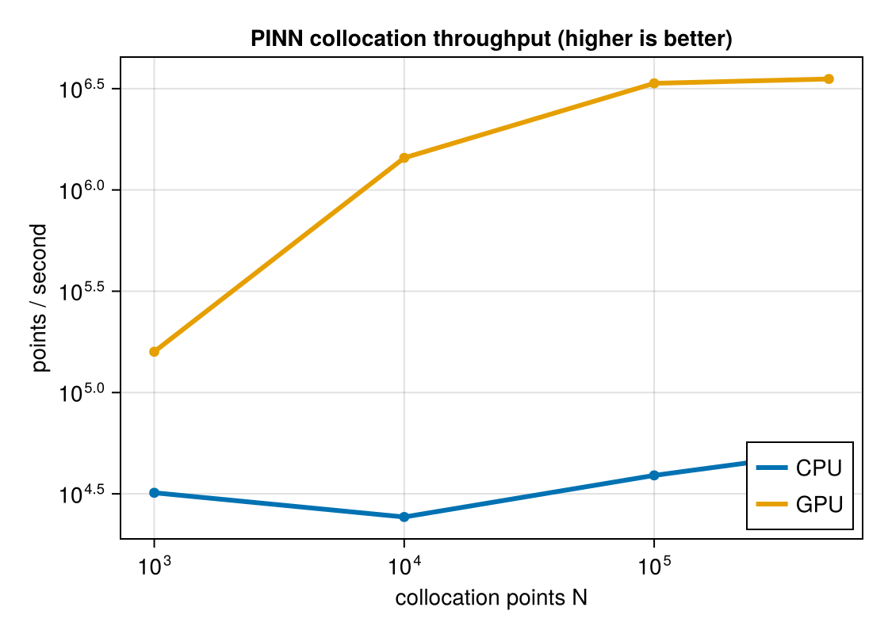

Vanilla PINNs work on some PDEs and fail surprisingly often on others.
We diagnose the failure modes (loss imbalance, spectral bias, causal
violation) on a column heat equation and on shallow water, then walk
through the modern fixes that mostly close the gap: causal training,
Fourier feature embeddings, hard boundary-condition enforcement,
adaptive loss weighting. By the end of the unit the toolkit needed for
the [capstone](../unit_09/unit_09.qmd) is in place.

## 7.1 Vanilla PINNs on PDEs

### The PINN Loss

A PINN approximates the solution $u(\mathbf{x}, t)$ with a neural
network $u_\theta(\mathbf{x}, t)$. The total loss combines a residual
term, boundary terms, and (for time-dependent problems) an initial
condition term:

$$\mathcal{L} = \lambda_r\,\mathcal{L}_{\text{PDE}}
+ \lambda_b\,\mathcal{L}_{\text{BC}}
+ \lambda_i\,\mathcal{L}_{\text{IC}},$$

with
$\mathcal{L}_{\text{PDE}} = \frac{1}{N_r}\sum_{i=1}^{N_r}|r(\mathbf{x}_i, t_i)|^2$
evaluated by autodiff at scattered **collocation points** — no grid,
no time-stepping.

### Heat Equation: A Sanity Check {#sec-heat}

The 1D diffusion equation $\partial_t u = \alpha\,\partial_x^2 u$ on
$[0, 1]\times[0, 2]$ with a Gaussian initial bump and zero boundaries.
Vanilla PINNs handle this well — useful as the first concrete
implementation.

```{julia}
#| eval: false

using NeuralPDE, Lux, ModelingToolkit, Optimization, OptimizationOptimJL
using DomainSets: ClosedInterval
using Plots

@parameters x t
@variables u(..)

Dₜ  = Differential(t)
Dₓₓ = Differential(x) ∘ Differential(x)

α = 0.01

eq = Dₜ(u(x, t)) ~ α * Dₓₓ(u(x, t))

domains = [
    x ∈ ClosedInterval(0.0, 1.0),
    t ∈ ClosedInterval(0.0, 2.0),
]

bcs = [
    u(x, 0)    ~ exp(-200 * (x - 0.5)^2),
    u(0.0, t)  ~ 0.0,
    u(1.0, t)  ~ 0.0,
]

@named pde_system = PDESystem(eq, bcs, domains, [x, t], [u(x, t)])

chain = Lux.Chain(
    Lux.Dense(2, 20, Lux.σ),
    Lux.Dense(20, 20, Lux.σ),
    Lux.Dense(20, 1),
)

discretization = PhysicsInformedNN(chain, GridTraining([0.05, 0.05]))
prob = discretize(pde_system, discretization)
res = Optimization.solve(prob, LBFGS(); maxiters=1500)
```

### Laplace on a Disk: Where Mesh-Free Helps

A clean elliptic example. The PINN handles the circular geometry
mesh-free — a classical advantage over finite differences. Closed-form
solution: $u(r, \theta) = r^3 \sin(3\theta)$.

{#fig-laplace-disk width=92%}

```{julia}
#| eval: false

using NeuralPDE, Lux, ModelingToolkit, Optimization, OptimizationOptimJL
using DomainSets, Plots

@parameters r θ
@variables u(..)

Dᵣ  = Differential(r);  Dᵣᵣ = Differential(r) ∘ Differential(r)
Dθθ = Differential(θ) ∘ Differential(θ)

eq = r^2 * Dᵣᵣ(u(r, θ)) + r * Dᵣ(u(r, θ)) + Dθθ(u(r, θ)) ~ 0

R = 1.0;  r_min = 0.05
domains = [r ∈ ClosedInterval(r_min, R), θ ∈ ClosedInterval(0.0, 2π)]
bcs = [
    u(R, θ)     ~ sin(3θ),
    u(r_min, θ) ~ r_min^3 * sin(3θ),
    u(r, 0.0)   ~ 0.0,
    u(r, 2π)    ~ 0.0,
]
@named pde_system = PDESystem(eq, bcs, domains, [r, θ], [u(r, θ)])

chain = Lux.Chain(
    Lux.Dense(2, 32, Lux.tanh), Lux.Dense(32, 32, Lux.tanh),
    Lux.Dense(32, 32, Lux.tanh), Lux.Dense(32, 1),
)

discretization = PhysicsInformedNN(chain, GridTraining([0.05, 0.1]))
prob = discretize(pde_system, discretization)
res = Optimization.solve(prob, LBFGS(); maxiters=3000)
```

::: {#ex-7-1 .callout-note .section-exercise icon="false" collapse="true"}
## ✏️ Section exercise — grade the disk PINN against the exact harmonic

The Laplace-on-a-disk example has a closed-form answer,
$u(r, \theta) = r^3 \sin(3\theta)$ — so use it. Run the disk script
above, then evaluate the trained network on a $50 \times 100$ polar
grid and compute the relative $L^2$ error and the *worst-case*
pointwise error. Two follow-ups: (a) where on the disk does the
worst error sit — interior, outer boundary, or near the $r_{\min}$
cutoff — and what about the collocation cloud explains it?
(b) Re-run with the boundary condition changed to $\sin(6\theta)$
(exact solution $r^6\sin(6\theta)$) and report what happens to the
error — a first taste of the frequency story §7.2 tells.

::: {.exercise-hint tabindex="0"}
💡 Hint

::: {.exercise-hint-text}
After `Optimization.solve`, the trained network is callable via `discretization.phi([r, θ], res.u)`. Build the polar grid with two `range`s and a comprehension; relative $L^2$ is `sqrt(sum(abs2, err) / sum(abs2, exact))` and `findmax(abs.(err))` locates the worst point. For (b), only the `bcs` lines change.
:::
:::

::: {.exercise-solution-link}
[Go to solution →](../exercise_solutions/exercise_solutions.qmd#sol-7-1)
:::
:::

## 7.2 Why Naïve PINNs Fail

"Vanilla" PINN training — one global loss weight, smooth-MLP
ansatz, soft BC enforcement, simultaneous residual evaluation
across the whole space-time domain — works on the textbook
examples of §7.1 and breaks on most realistic problems. The
*characterisation* of why is by now well understood; the dominant
references are
[Krishnapriyan et al. 2021](../references/references.qmd#ref-krishnapriyan2021){target="_blank"}
("Characterizing possible failure modes in PINNs"),
[Wang et al. 2022](../references/references.qmd#ref-wang2022causal){target="_blank"}
on causality, and the NTK-based diagnostics of
[Wang et al. 2021](../references/references.qmd#ref-wang2021ntk){target="_blank"}.
They converge on three intertwined failure modes, covered below in
order of how often they hit you in practice: **loss imbalance**,
**spectral bias**, **causal violation**. The benchmark survey of
[de Wolff et al. 2021](../references/references.qmd#ref-dewolff2021){target="_blank"}
adds a useful reproducibility study — same failures, on
shallow-water and advection–diffusion — but it isn't the
foundational reference; the failure modes themselves were
identified earlier and more cleanly elsewhere.

### Loss imbalance between residual and boundary terms

The total loss

$$
\mathcal{L} \;=\; \lambda_r\,\mathcal{L}_{\text{PDE}}
              + \lambda_b\,\mathcal{L}_{\text{BC}}
              + \lambda_i\,\mathcal{L}_{\text{IC}}
              + \lambda_d\,\mathcal{L}_{\text{data}}
$$

is a sum of terms whose magnitudes can differ by orders of
magnitude — easily $10^3$ in problems with sharp ICs or stiff
BCs. The optimiser drives the largest term to zero first; if
that's a term you don't care about, the others stagnate. The
classic failure: $\mathcal{L}_{\text{PDE}}$ hits machine precision
but the BC is still off by $10^{-1}$, producing a function that
satisfies the equation in the interior but ignores the boundary.
Krishnapriyan et al. show this is the *generic* outcome for
PINNs on convection-dominated and high-frequency problems.

### Spectral bias

Smooth-activation MLPs are biased toward learning **low-frequency**
components first
([Rahaman et al. 2019](../references/references.qmd#ref-rahaman2019){target="_blank"};
[Tancik et al. 2020](../references/references.qmd#ref-tancik2020){target="_blank"}).
High-frequency features — sharp ICs, oscillatory solutions, fine
spatial structure — take many more iterations or never converge.
The §6.2 Fourier-mode analysis says exactly why: each Fourier
mode has its own loss-landscape curvature; the high-$k$ modes are
poorly conditioned and Adam barely moves their parameters.

This is the same effect that makes diffusion solvers smooth fast
data (every Fourier component decays at rate $\propto k^2$) — the
PINN inherits the bias from its parameterisation, not from the
physics. The fix (Fourier feature embeddings, §7.3) is also
Fourier-shaped.

### Causal violation in time-dependent problems

The PDE residual is evaluated at all $(\mathbf{x}_i, t_i)$
collocation points simultaneously. *Nothing in the loss* requires
that the solution at $t_2$ be a *consequence* of the solution at
$t_1 < t_2$. The optimiser can find a globally inconsistent
solution whose residual is small everywhere but whose
time-direction information flow is wrong — invisible to the loss
but obvious in the predicted trajectory.

[Wang et al. 2022](../references/references.qmd#ref-wang2022causal){target="_blank"}
gave the clean diagnostic — residual histograms vs $t$ that don't
decrease with training time — and the matching fix (causal
training, §7.3). It's the failure mode that most often bites
real-world inverse problems, including the Unit 1 shallow-water
source-recovery example.

### A benchmark catalogue worth knowing about

For a head-to-head comparison of vanilla PINNs against three
non-trivial PDEs — a variable-depth wave equation, the 2-D
linearised shallow-water system with Coriolis and viscosity, and
SWE-driven advection–diffusion of a thermal anomaly —
[de Wolff et al. 2021](../references/references.qmd#ref-dewolff2021){target="_blank"}
is a useful reference. Their headline finding (vanilla PINN
underperforms a pure-data MLP on all three) is consistent with the
failure modes above; it's a *negative reproducibility* result, not
a new diagnosis. We reproduce the cleanest case — the 1-D
reduction of their linearised SWE — below to make the failure
concretely visible before we discuss fixes.

### Worked example: naïve linearised shallow water {#sec-de-wolff}

A 1-D reduction of the linearised SWE
($\eta_t + H u_x = 0,\;u_t + g\eta_x = 0$ on $[0, 2]\times[0,
0.05]$) trains in seconds and exhibits all three failure modes
above. The same example in 2-D has the same flavour, just
slower:

![What naïve PINN training on the 1-D linearised SWE looks like. **Left:** at the half-time snapshot, the FD reference shows two counter-propagating Gaussian bumps; the naïve PINN (red dashed) over-smooths into a single broad lump and drifts at the right boundary (BC misfit). **Right:** the residual-vs-time histogram doesn't decrease — late-time bins are *larger* than early-time ones, the textbook signature of causality violation. **Bottom:** the three failure modes diagnosed by §7.2 and the modern fixes from §7.3 that each one motivates.](figures/naive_swe_failure.svg){#fig-naive-swe width=92%}

```{julia}
#| eval: false

using NeuralPDE, Lux, ModelingToolkit, Optimization, OptimizationOptimJL
using DomainSets, Plots

@parameters x t
@variables η(..) u_vel(..)

Dₜ = Differential(t);  Dₓ = Differential(x)
g = 9.81;  H = 10.0   # wave speed c ≈ 9.9 m/s

eqs = [
    Dₜ(η(x, t)) + H * Dₓ(u_vel(x, t)) ~ 0,
    Dₜ(u_vel(x, t)) + g * Dₓ(η(x, t)) ~ 0,
]

domains = [x ∈ ClosedInterval(0.0, 2.0), t ∈ ClosedInterval(0.0, 0.05)]

bcs = [
    η(x, 0)        ~ exp(-100 * (x - 1.0)^2),
    u_vel(x, 0)    ~ 0.0,
    u_vel(0.0, t)  ~ 0.0,
    u_vel(2.0, t)  ~ 0.0,
]

@named pde_system = PDESystem(eqs, bcs, domains, [x, t], [η(x, t), u_vel(x, t)])

chain_η = Lux.Chain(Lux.Dense(2, 32, tanh), Lux.Dense(32, 32, tanh),
                    Lux.Dense(32, 32, tanh), Lux.Dense(32, 1))
chain_u = Lux.Chain(Lux.Dense(2, 32, tanh), Lux.Dense(32, 32, tanh),
                    Lux.Dense(32, 32, tanh), Lux.Dense(32, 1))

discretization = PhysicsInformedNN([chain_η, chain_u], GridTraining([0.02, 0.001]))
prob = discretize(pde_system, discretization)
res = Optimization.solve(prob, LBFGS(); maxiters=3000)
```

Train this and you'll see all three pathologies above: the BC at
$x = 0, 2$ never tightens because $\mathcal{L}_{\text{PDE}}$
dominates the loss budget; the initial Gaussian bump oversmooths
because of spectral bias; the predicted $\eta(x, t)$ at late times
doesn't propagate the IC correctly because of causal violation.
This is the **target failure** that §7.3 dismantles.

::: {#ex-7-2 .callout-note .section-exercise icon="false" collapse="true"}
## ✏️ Section exercise — reproduce the failure, then prove it

Run the 1-D linearised-SWE script above (it trains in seconds) and
produce the two diagnostics from @fig-naive-swe yourself:

1. The half-time snapshot of $\eta(x, t)$ against an FD reference —
   a 20-line leapfrog solver of the same system is enough (or
   d'Alembert: the IC splits into two half-height bumps moving at
   $c = \sqrt{gH} \approx 9.9$ m/s).
2. The residual-vs-time histogram: evaluate the PDE residual on a
   dense grid, bin by $t$ into 10 bins, and plot the mean per bin.

State which of the three failure modes each diagnostic exposes.
Then the cheap experiment: multiply the BC loss terms by 100 (crude
manual loss-balancing) and report which symptom improves and which
doesn't — evidence that the three failure modes really are
*distinct* diseases.

::: {.exercise-hint tabindex="0"}
💡 Hint

::: {.exercise-hint-text}
The cheapest reference isn't FD at all — d'Alembert says the IC splits into two half-height bumps moving at $\pm\sqrt{gH}$, which you can evaluate in closed form at the snapshot time. For the histogram, evaluate the residual with nested `ForwardDiff` on `discretization.phi`, bin by $t$ with a comprehension, and plot the per-bin mean.
:::
:::

::: {.exercise-solution-link}
[Go to solution →](../exercise_solutions/exercise_solutions.qmd#sol-7-2)
:::
:::

## 7.3 Modern Fixes

### Causal Training

[Wang et al. (2022)](../references/references.qmd#ref-wang2022causal){target="_blank"}: weight residual losses at later times by how
well earlier times have already converged. Concretely,

$$\lambda(t_i) = \exp\!\Bigl(-\epsilon \sum_{t_j < t_i} \mathcal{L}_{\text{PDE}}(t_j)\Bigr),$$

so a time slice contributes only after earlier slices have been
resolved. Trains the network in the right *temporal causal order*
without explicit time-stepping.

### Fourier Feature Embeddings

Wrap each input in a Fourier feature transform

$$\gamma(\mathbf{x}) = [\sin(B\mathbf{x}),\, \cos(B\mathbf{x})]$$

with frequencies $B$ drawn from a distribution that includes the
high frequencies you need ([Tancik et al., 2020](../references/references.qmd#ref-tancik2020){target="_blank"}). The network sees
high-frequency content in its input directly, breaking spectral
bias. A simple recipe: $B \sim \mathcal{N}(0, \sigma^2 I)$ with
$\sigma$ tuned per problem.

### Hard Boundary Condition Enforcement

Instead of penalising BC violations softly, **construct** the
network output to satisfy them by construction. For Dirichlet BCs
on $[0, 1]$ with $u(0, t) = u(1, t) = 0$, write

$$u_\theta(x, t) = x(1 - x)\,N_\theta(x, t).$$

Now $u_\theta = 0$ on the boundary regardless of $N_\theta$. The
loss has one fewer term to balance, and the optimiser has fewer
ways to fail. The trick generalises to other BC types via clever
ansätze ([Sukumar & Srivastava, 2022](../references/references.qmd#ref-sukumar2022){target="_blank"}).

### Adaptive Loss Weighting

Tune $\lambda_r, \lambda_b, \lambda_i$ during training so all terms
stay roughly balanced. Three families of approaches:

- **Gradient-balancing** ([McClenny & Braga-Neto, 2022](../references/references.qmd#ref-mcclenny2022){target="_blank"}) — match the
  gradient norms of each term.
- **NTK-based** ([Wang et al., 2021](../references/references.qmd#ref-wang2021ntk){target="_blank"}) — use the neural tangent kernel
  to compute target weights.
- **Annealing** — start with one term dominant, gradually shift
  weight to others.

All beat hand-tuning. With these, the modern PINN is ready for the
problems §7.4 catalogues.

::: {#ex-7-3 .callout-note .section-exercise icon="false" collapse="true"}
## ✏️ Section exercise — Fourier features in twenty lines

Isolate the spectral-bias cure from all PINN machinery. Fit
$f(x) = \sin(25x)$ on $[0, 1]$ from 200 samples with two `Lux`
networks: (a) a plain 1 → 64 → 64 → 1 `tanh` MLP, and (b) the same
MLP fed the Fourier-feature embedding
$\gamma(x) = [\sin(Bx), \cos(Bx)]$ with 16 frequencies
$B \sim \mathcal{N}(0, 10^2)$ (so input width 32). Train both with
identical Adam budgets (2 000 iterations) and plot the two
loss curves and the two fits. Then break it: re-draw $B$ with
$\sigma = 1$ and with $\sigma = 100$, and describe both failure
directions. The takeaway to write in one sentence: what does
$\sigma$ have to match for the embedding to work? Separately,
verify the **hard-BC trick**: show that
$u_\theta(x, t) = x(1 - x)N_\theta(x, t)$ satisfies
$u(0, t) = u(1, t) = 0$ for any network, and find an analogous
ansatz that enforces $u(x, 0) = g(x)$.

::: {.exercise-hint tabindex="0"}
💡 Hint

::: {.exercise-hint-text}
The embedding is a fixed (untrained) layer: `Lux.WrappedFunction(x -> vcat(sin.(B * x), cos.(B * x)))` with `B` drawn once — remember the next `Dense` layer's input width doubles to 2×16. Keep the Adam budget identical across runs or the comparison proves nothing. For the hard-IC ansatz, ask what function of $t$ vanishes at $t=0$ regardless of the network.
:::
:::

::: {.exercise-solution-link}
[Go to solution →](../exercise_solutions/exercise_solutions.qmd#sol-7-3)
:::
:::

## 7.4 A taxonomy of PINN workflows

"A PINN" isn't a single recipe — it's a family of training
configurations differentiated by *which loss terms are present*,
*what the network represents*, and *what's known vs unknown going
in*. The four workflows below account for almost everything in
the published literature. Pick the one whose "Unknown" column
matches what you don't know.

### Quick-reference: pick a workflow

| | **W1 · Forward solve** | **W2 · Parameter ID** | **W3 · Source / driver recovery** | **W4 · Hybrid simulator** |
|---|---|---|---|---|
| **Unknown** | the field $u(\mathbf{x}, t)$ itself | scalar $\boldsymbol{\xi}$ in the PDE | a function $f(t)$ or $g(\mathbf{x})$ | a closure / sub-grid term |
| **Loss terms** | residual + IC + BC | + data | + data | + data |
| **Network represents** | $u_\theta$ | $u_\theta$ + scalar $\xi$ | $u_\theta$ + $f_\phi$ | $u_\theta$ + closure $N_\phi$ |
| **Canonical example** | Burgers' eq forward solve | recover diffusivity from sparse $u$ | **Unit 1**: ψ(t) from gauges | sub-grid turbulence closure |
| **In the workshop** | [Unit 5 §5.4](../unit_05/unit_05.qmd) | (course tangent) | [Unit 1 §1.2](../unit_01/unit_01.qmd), [Unit 9–10](../unit_09/unit_09.qmd) | [Unit 4 §4.3](../unit_04/unit_04.qmd) (UDEs, ODE form) |

Each workflow is laid out below as a self-contained card.

```{=html}
<style>
  .workflow-card {
    margin: 1.2em 0;
    border-radius: 6px;
    overflow: hidden;
    border: 1px solid #ccc;
  }
  .workflow-card .workflow-head {
    padding: 0.6em 1em;
    font-weight: bold;
    font-size: 1.05em;
    color: #fff;
  }
  .workflow-card .workflow-body {
    padding: 0.8em 1em;
    background: #fcfcfd;
  }
  .workflow-card .workflow-body > p { margin: 0.4em 0; }
  .workflow-card .workflow-body strong.tag {
    display: inline-block;
    min-width: 8.5em;
    color: #333;
  }
  .workflow-w1 .workflow-head { background: #3a87a8; }
  .workflow-w2 .workflow-head { background: #5b9b53; }
  .workflow-w3 .workflow-head { background: #b25a3f; }
  .workflow-w4 .workflow-head { background: #7e57c2; }
</style>
```

::: {.workflow-card .workflow-w1}
::: {.workflow-head}
W1 · Forward solve — replace the numerical solver
:::
::: {.workflow-body}
**Setup.** Given a PDE + IC + BC, train $u_\theta(\mathbf{x}, t)$
to satisfy them. Loss
$= \mathcal{L}_{\text{PDE}} + \mathcal{L}_{\text{IC}} + \mathcal{L}_{\text{BC}}$.
No data term. The trained network *is* the solution.

**Canonical example.** Solve $u_t = \alpha u_{xx}$ with given
initial and boundary conditions — the heat-equation sanity check
in [§7.1](#sec-heat) above is exactly this shape.

**Reach for it when…** Mesh-free needed (irregular geometry,
no quadrature scheme); continuous-resolution surrogate wanted
(query $u_\theta(\mathbf{x}, t)$ at any coordinate, no
re-meshing); downstream optimisation needs $\partial u / \partial \mathbf{x}$
cheaply via autodiff.

**Don't reach for it when…** A tuned FD / FV / FEM solver on
its own mesh already exists. PINN forward solves are rarely
faster or more accurate; the benefit is the *meshless* +
*differentiable* properties, not raw speed.
:::
:::

::: {.workflow-card .workflow-w2}
::: {.workflow-head}
W2 · Parameter identification — recover scalar unknowns
:::
::: {.workflow-body}
**Setup.** As W1 plus a **data loss**
$\mathcal{L}_{\text{data}} = \frac{1}{N}\sum_i (u_\theta(\mathbf{x}_i, t_i) - u_{\text{obs}, i})^2$,
*and* the PDE contains unknown scalar parameters
$\boldsymbol{\xi} = (\xi_1, \xi_2, \ldots)$ that are optimised
jointly with the network weights $\theta$.

**Canonical example.** Recover a diffusion coefficient $\alpha$
in $u_t = \alpha u_{xx}$ from sparse, noisy measurements of
$u$. Or: recover $(\sigma, \rho, \beta)$ in Lorenz from a
trajectory.

**Reach for it when…** The parametric form is known and you have
at least order-of-magnitude informative data. PINNs beat
classical inverse methods when the forward map is hard to make
adjoint-differentiable (e.g., the simulator is a black box, or
the adjoint code doesn't exist).

**Don't reach for it when…** The parameter set is high-dimensional
($\boldsymbol{\xi} \in \mathbb{R}^{100+}$); classical Bayesian
inference with MCMC is the right tool, not gradient descent on a
PINN loss.
:::
:::

::: {.workflow-card .workflow-w3}
::: {.workflow-head}
W3 · Source / driver recovery — recover an unknown function (functional inverse)
:::
::: {.workflow-body}
**Setup.** As W2 but the unknown is a *function*, not a scalar:
a boundary-condition timeseries $\psi(t)$, a spatially varying
source $f(\mathbf{x})$, a closure law $g(\mathbf{u})$.
Parameterise the unknown with a small auxiliary network
$\psi_\phi$ trained jointly with $u_\theta$, or directly read it
off $u_\theta$ at a designated coordinate.

**Canonical example.** **[Unit 1 §1.2](../unit_01/unit_01.qmd)** —
recover the unknown river-mouth ψ(t) from four bay tide-gauge
timeseries. The **[Unit 9 / Unit 10 capstone](../unit_09/unit_09.qmd)**
is the same shape on the column-temperature geometry.

**Reach for it when…** The missing piece isn't a number but a
shape, and you suspect it's reasonably smooth (so a small
auxiliary network + smoothness prior is well-posed). Most
field-science source-recovery problems live here.

**Don't reach for it when…** A well-tested adjoint inversion
exists for your forward map — the Unit 1 worked example shows
the adjoint inverse often beats the naïve PINN by a wide margin
on linear forward maps. PINNs come into their own when the
forward map is nonlinear and the adjoint is hard to write.
:::
:::

::: {.workflow-card .workflow-w4}
::: {.workflow-head}
W4 · Hybrid simulator (data assimilation + UDE) — learn a closure
:::
::: {.workflow-body}
**Setup.** Combine a known PDE residual, sparse observations,
*and* a learned closure / forcing term in one loss. This is the
**Universal Differential Equation** picture of
[Unit 4 §4.3](../unit_04/unit_04.qmd) lifted to PDEs. The
network $N_\phi$ represents the *unknown closure*
(e.g. $\dot{\mathbf{x}} = f_{\text{known}} + N_\phi$), not the
full solution.

**Canonical example.** Sub-grid turbulence closures in climate
models; reaction-rate corrections in chemistry; bottom-friction
laws in shallow-water models calibrated against gauge data.
The Crown-of-Thorns starfish UDE in
[Unit 4 §4.3](../unit_04/unit_04.qmd) is a one-dimensional
analogue: known logistic growth + Holling-II grazing + learned
mortality closure.

**Reach for it when…** You have trustworthy physics, observations,
*and* a known gap between them. The biggest current growth area
in scientific ML and the most defensible choice for production
work — the learned piece is small, local, and individually
interpretable.

**Don't reach for it when…** You don't actually have a known
physics skeleton — at that point you're doing pure data-driven
ML, not physics-informed ML, and you should reach for a
different toolset.
:::
:::

### How to pick: a decision tree

Walk the questions top-to-bottom and stop at the first "yes":

1. *Do you have field data?* — No → **W1** (forward solve).
2. *Is the missing piece a small number of scalars?* — Yes → **W2** (parameter ID).
3. *Is the missing piece a function (timeseries, spatial field, closure law)?*
    - …and you trust the whole governing equation as written → **W3** (source recovery).
    - …and there's a *known gap* between the governing equation and reality → **W4** (hybrid simulator).

Almost every PINN paper in the 2019–2026 corpus lands in one of
these four. The Unit 1 worked example, the capstone, and the
modern fixes from §7.3 are all aimed at making **W3** practical
on real problems; that's the through-line of the workshop.

::: {#ex-7-4 .callout-note .section-exercise icon="false" collapse="true"}
## ✏️ Section exercise — file these five papers

Classify each published setup into W1–W4 using the quick-reference
table, and name the giveaway:

1. *Hidden Fluid Mechanics* (§7.7): given dye-concentration movies,
   reconstruct the unmeasured velocity and pressure fields under a
   Navier–Stokes residual.
2. A PINN solves Burgers' equation from IC + BCs alone, benchmarked
   against a spectral solver.
3. From sparse pressure-head wells, recover the scalar parameters of
   a van-Genuchten soil-retention curve *and* the head field.
4. A climate model keeps its dynamical core but learns a sub-grid
   cloud-microphysics correction from high-resolution simulation
   output.
5. The Unit 1 problem: four tide gauges, known SWE physics, unknown
   river-mouth timeseries ψ(t).

One of the five is genuinely arguable between two workflows — say
which, and defend both readings.

::: {.exercise-hint tabindex="0"}
💡 Hint

::: {.exercise-hint-text}
Run the §7.4 decision tree on each: is the unknown the *field itself*, a few *scalars*, a *function*, or a *correction to trusted physics*? For the arguable one, ask whether the governing equations contain any unknown at all — and then ask what's substituting for the missing BCs/ICs.
:::
:::

::: {.exercise-solution-link}
[Go to solution →](../exercise_solutions/exercise_solutions.qmd#sol-7-4)
:::
:::

## 7.5 The inverse problem in practice

Workflows 2 and 3 above are *the* operational reason to use
PINNs in field science. They also fail in characteristic ways
worth flagging.

### When it works

- **Reasonably dense observations.** The Unit 1 example uses 4
  gauges over 6 hours, ~120 samples each — enough to identify a
  smooth ψ(t).
- **Well-posed forward physics.** If the forward map is invertible
  *in principle* (i.e., the data determines the unknown up to a
  small null space), regularisation gets you the rest of the way.
- **Smooth unknowns.** Smooth ψ(t) / smooth source field; smooth-MLP
  ansatz is well-matched.
- **Modern fixes applied.** Causal training, Fourier features,
  hard BC, adaptive weights — pre-§7.3 PINNs lose to classical
  adjoint methods on most realistic inverse problems.

### When it doesn't

- **Severe ill-posedness.** Many possible unknowns produce
  near-identical observations; no amount of data fixes this.
  Tikhonov / Bayesian regularisation is required. The Unit 1
  comparison ("naïve PINN fits the gauges but misses the source
  amplitude") is exactly this story.
- **Discontinuous unknowns** (step changes, shocks). Smooth-MLP
  PINNs round them off. KANs ([Unit 2 §2.8](../unit_02/unit_02.qmd))
  or spectral basis ansätze are alternatives worth trying.
- **Very noisy data.** Without a noise model in the loss, PINNs
  overfit observation noise. Adding a Gaussian-likelihood
  $\mathcal{L}_{\text{data}}$ helps but isn't free.

### A practical recipe

For inverse problems of Workflow 2 or 3 flavour:

1. **Start with the classical solution if you have one.** Adjoint
   inversion or Tikhonov-regularised LSQ — these are battle-tested
   on linear forward maps. Use them as the reference.
2. **Set up the PINN forward problem first** (Workflow 1) and
   verify it converges on a representative parameter set.
3. **Add the data term gradually** — start with the data weight at
   $10^{-2}\times$ the residual weight, then ramp it up. (Adaptive
   weighting from §7.3 makes this automatic.)
4. **Diagnose with residual histograms.** A PINN whose residual
   doesn't decrease uniformly in $t$ is causality-violating; fix
   that before believing the recovered source.
5. **Sanity-check on a known truth.** Generate synthetic data
   from a known ψ; recover it; ensure the recovered shape and
   amplitude are within tolerance. Only then turn it loose on
   real data.

The next three sections (§§7.6–7.8) zoom out to the practical
ecosystem around all of this: the software you'd build a PINN with
([§7.6](#sec-software)), where PINNs have actually delivered in
the published literature (§7.7), and the commercial / industrial
deployments worth knowing about (§7.8).

::: {#ex-7-5 .callout-note .section-exercise icon="false" collapse="true"}
## ✏️ Section exercise — recover a diffusivity (Workflow 2, end-to-end)

The smallest honest inverse problem. Generate synthetic data from
the heat equation with *known* $\alpha^\star = 0.07$: solve
$u_t = \alpha^\star u_{xx}$ on $[0,1]\times[0,1]$ (FD, Dirichlet
BCs, $u_0 = \sin(\pi x)$ — or just use the exact solution
$e^{-\alpha^\star \pi^2 t}\sin(\pi x)$), sample 50 random interior
points, add 1% noise. Now *forget* $\alpha^\star$ and recover it:
train a small PINN $u_\theta$ with a **trainable scalar** $\alpha$
in the residual, jointly over $(\theta, \alpha)$, following the
§7.5 recipe (forward sanity-check first, then add the data term).
Report the recovered $\alpha$, then re-run with 5% noise and with
10 data points and tabulate the degradation. Which item of the
"when it doesn't work" list do you hit first?

::: {.exercise-hint tabindex="0"}
💡 Hint

::: {.exercise-hint-text}
Make α trainable by log-parameterising it (`logα`) and appending it to a `ComponentArray` alongside the network parameters — Zygote then differentiates through both. Kill the BC/IC terms with the hard ansatz `sin(πx)·(1 + t·N_θ(x,t))` so the loss has only residual + data. Follow the §7.5 recipe order: forward sanity-check *before* adding the data term.
:::
:::

::: {.exercise-solution-link}
[Go to solution →](../exercise_solutions/exercise_solutions.qmd#sol-7-5)
:::
:::

## 7.6 The PINN software ecosystem {#sec-software}

A practitioner reading the 2026 PINN literature will hit at least
three software stacks. The next three subsubsections lay out the
Julia, Python, and commercial offerings so the reader can place
*any* PINN paper or product on the map. All claims are sourced from
canonical project pages or release notes as of mid-2026.

### Julia: the SciML stack

The workshop standardises on the SciML stack — the same one
[Zubov et al. 2021](../references/references.qmd#ref-zubov2021){target="_blank"}
describe in the `NeuralPDE.jl` companion paper. The pieces every
PINN workflow touches:

| Package | Role |
|---|---|
| [`NeuralPDE.jl`](https://github.com/SciML/NeuralPDE.jl){target="_blank"} | Symbolic PINN solver — takes a `PDESystem` and builds the physics-informed loss automatically. |
| [`Lux.jl`](https://lux.csail.mit.edu/stable/){target="_blank"} | Explicit-parameter neural-network framework; the recommended NN backend inside `NeuralPDE`. |
| [`ModelingToolkit.jl`](https://github.com/SciML/ModelingToolkit.jl){target="_blank"} | Symbolic CAS — defines `PDESystem`, the canonical PDE input. |
| [`MethodOfLines.jl`](https://github.com/SciML/MethodOfLines.jl){target="_blank"} | Finite-difference discretiser of `PDESystem`s — useful for FD reference solutions to benchmark a PINN against. |
| [`OrdinaryDiffEq.jl`](https://github.com/SciML/OrdinaryDiffEq.jl){target="_blank"} | Tsit5, Rodas5P, QNDF, … — used inside Neural-ODE / UDE training and to generate ground-truth trajectories. |
| [`Optimization.jl`](https://docs.sciml.ai/Optimization/stable/){target="_blank"} | Unified wrapper over Optim, Optimisers, NLopt, … — what `NeuralPDE` drives for Adam / L-BFGS training. |
| [`SciMLSensitivity.jl`](https://docs.sciml.ai/SciMLSensitivity/stable/){target="_blank"} | Forward / adjoint backends (`InterpolatingAdjoint`, `BacksolveAdjoint`, `EnzymeVJP`) for gradients through ODE/PDE solves. |
| [`Zygote.jl`](https://github.com/FluxML/Zygote.jl){target="_blank"} / [`ForwardDiff.jl`](https://github.com/JuliaDiff/ForwardDiff.jl){target="_blank"} / [`Enzyme.jl`](https://github.com/EnzymeAD/Enzyme.jl){target="_blank"} | Reverse-mode, dual-number forward, and LLVM-level AD. Compose as Unit 5 §5.2 describes; Enzyme is increasingly the default in 2025–26. |
| [`NeuralOperators.jl`](https://github.com/SciML/NeuralOperators.jl){target="_blank"} | DeepONet, FNO, Markov NO, NOMAD — pairs with `NeuralPDE` for PINO-style losses. |
| [`KolmogorovArnold.jl`](https://github.com/vpuri3/KolmogorovArnold.jl){target="_blank"} | Lux-compatible KAN layers (see [Unit 2 §2.8](../unit_02/unit_02.qmd)). |

A consolidation note worth knowing: the older Flux-based stack
(`DiffEqFlux`, `FluxNeuralOperators`) is being superseded by the
`Lux + Reactant + Enzyme` stack across SciML; new projects should
start with the right column.

### Python: DeepXDE, PhysicsNeMo, JAX, PyTorch

The Python side is more fragmented because there's no single
maintainer. The pieces:

| Package | Role |
|---|---|
| [`DeepXDE`](https://github.com/lululxvi/deepxde){target="_blank"} | Reference Python PINN library (Lu Lu, originally Karniadakis group). Multi-backend (TF, PyTorch, JAX, PaddlePaddle); forward + inverse ODE/PDE/IDE with CSG geometries. |
| [`NVIDIA PhysicsNeMo`](https://github.com/NVIDIA/physicsnemo){target="_blank"} | PyTorch-based physics-ML framework (formerly *Modulus*). Covers PINNs, FNOs, MeshGraphNets, diffusion surrogates. |
| [`PhysicsNeMo-Sym`](https://github.com/NVIDIA/physicsnemo-sym){target="_blank"} | Symbolic PDE/BC layer (formerly *Modulus-Sym*) — closest Python analogue to `NeuralPDE.jl`. |
| [`PINA`](https://github.com/mathLab/PINA){target="_blank"} | PyTorch-Lightning-based PINN + neural operator + PINO library (mathLab @ SISSA, Rozza group). |
| [`Diffrax`](https://github.com/patrick-kidger/diffrax){target="_blank"} | JAX ODE/SDE/CDE solvers (Patrick Kidger) — the JAX counterpart to `OrdinaryDiffEq.jl`. |
| [`Equinox`](https://github.com/patrick-kidger/equinox){target="_blank"} | Callable-PyTree NN layers in JAX; the foundation of `Diffrax` and most JAX PINN code. |
| [`Flax (NNX)`](https://github.com/google/flax){target="_blank"} | Google's JAX NN library; NNX (2024) is the current object-oriented API. |
| [`jinns`](https://github.com/mia-jinns/jinns){target="_blank"} | JAX-native PINN library (PINNs, SPINNs, HyperPINNs, adaptive weights) on Equinox + Optax. |
| [`torchdiffeq`](https://github.com/rtqichen/torchdiffeq){target="_blank"} / [`torchdyn`](https://github.com/DiffEqML/torchdyn){target="_blank"} | Differentiable ODE solvers in PyTorch; standard for neural-ODE and Burgers-class PINN demos. |
| [`PySINDy`](https://github.com/dynamicslab/pysindy){target="_blank"} | Sparse identification of nonlinear dynamics; the discovery-side companion to PINNs ([Unit 3 §3.4](../unit_03/unit_03.qmd)). |
| [`pykan`](https://github.com/KindXiaoming/pykan){target="_blank"} | Reference KAN implementation accompanying Liu et al. 2024. |

### Commercial and enterprise offerings

The line between "PINN" and "AI surrogate trained on simulation
data" is blurry in vendor marketing. Be precise: only the items
in the *first* column below train against a PDE residual; the
second column are physics-aware *data* surrogates (still useful,
still physics-informed in a loose sense, but not PINNs).

| Residual-loss PINN-aware | AI surrogate on simulation data |
|---|---|
| [NVIDIA PhysicsNeMo](https://developer.nvidia.com/physicsnemo){target="_blank"} (commercial framing of the open-source core) | [Ansys SimAI](https://www.ansys.com/products/ai/simai){target="_blank"} (physics-agnostic surrogate, FEM-trained) |
| [Altair PhysicsAI](https://altair.com/physicsai){target="_blank"} (geometric DL + surrogate; explicit-dynamics speedups) | [COMSOL 6.2+ surrogate nodes](https://www.comsol.com/release/6.2/surrogate-models){target="_blank"} (DNN, GP, polynomial-chaos) |
| [SimScale Physics AI](https://www.simscale.com/product/physics-ai/){target="_blank"} (built on PhysicsNeMo; centrifugal-pump foundation model GA March 2025) | [Siemens Simcenter AI assistants](https://plm.sw.siemens.com/en-US/simcenter/){target="_blank"} (post-processing + generative design) |
| [Pasteur Labs SI Platform](https://pasteurlabs.ai/){target="_blank"} (pre-GA late 2025; differentiable simulators + AI; defence/energy) | [Wolfram](https://community.wolfram.com/groups/-/m/t/2557040){target="_blank"} (PINN as community notebooks, not branded product) |

The Ansys × NVIDIA SeaScape integration (November 2024) is the
hybrid case — Ansys' semiconductor signoff toolchain
(RedHawk-SC, Totem-SC, PathFinder-SC) now embeds PhysicsNeMo for
power-integrity surrogates.

::: {#ex-7-6 .callout-note .section-exercise icon="false" collapse="true"}
## ✏️ Section exercise — pick the package

For each job below, name the *one* package from the §7.6 tables
you'd reach for first (Julia or Python — your call), and the
runner-up from the other ecosystem:

1. Generate a trusted FD reference solution for the capstone column
   PDE, starting from a symbolic `PDESystem`.
2. Train a PINN for a PDE specified symbolically, in Julia.
3. Backprop through an ODE solve in a JAX codebase.
4. Recover a sparse symbolic equation from trajectory data.
5. A PyTorch team wants industrial-grade PINN + neural-operator
   tooling with vendor support and GPU recipes.
6. Swap a KAN into an existing Lux-based PINN.

::: {.exercise-hint tabindex="0"}
💡 Hint

::: {.exercise-hint-text}
Rows 1–2 reward the symbolic Julia stack (`ModelingToolkit`-based); row 3 is the Kidger JAX ecosystem; row 4 is the Brunton group's; row 5 is NVIDIA's; row 6 needs the one Lux-compatible KAN package in the §7.6 table. The interesting part is which rows have *no* good answer in the other ecosystem.
:::
:::

::: {.exercise-solution-link}
[Go to solution →](../exercise_solutions/exercise_solutions.qmd#sol-7-6)
:::
:::

### Why a GPU changes which PINNs you can afford {#sec-gpu}

Everything in §7.2–§7.3 — causal training, adaptive resampling, curriculum
schedules, high-frequency problems — ultimately spends the same currency:
**collocation points**. Each residual point is one forward pass through the
network (plus a few more for the derivative stencil) and one reverse-mode pass
for the parameter gradient. So the practical ceiling on a PINN is blunt: *how
many collocation points can you push through a training step per second?* That
is a batched-matmul throughput question — exactly the workload a GPU rewrites.

The script below measures one full training step of a Poisson PINN
($\Delta u = f$, with the Laplacian taken by the finite-difference-in-input
stencil from §5.3 and the parameter gradient by Zygote — the same Lux path used
throughout the course), sweeping the collocation batch from $10^3$ to
$5\times10^5$ on the CPU and the GPU:

```{.julia filename="units/unit_07/scripts/pinn_throughput_gpu.jl" code-fold="true" code-summary="Show the PINN throughput benchmark"}

```

Captured on the workshop GPU hub (NVIDIA L4):



At a thousand points the GPU is barely ahead — the batch is too small to hide
kernel-launch latency. But the CPU's throughput is roughly **flat** (it is
already saturated at $N=1000$), while the GPU keeps filling: by $N=10^4$ it is
~60× faster per step, and across the useful range it sustains **1–2 million
collocation points per second** against the CPU's ~50 000. That is the
difference between a PINN you resample aggressively every few hundred iterations
and one you cannot afford to. It is the same lever Unit 6's heat solver pulled
([§6.4](../unit_06/unit_06.qmd#sec-heat2d-gpu)) — a perfectly parallel,
matmul-bound workload — applied to the residual loss instead of a stencil step.



## 7.7 Where PINNs have shown success — a survey of the literature

The published-results landscape is uneven: some domains have
flagship PINN successes, others have *almost no* PINN
penetration despite headline ML activity. This section names the
keystone papers in seven application areas, with the
limitations the original authors acknowledged. The three surveys
worth keeping next to a screen
([Karniadakis et al. 2021](../references/references.qmd#ref-karniadakis2021){target="_blank"},
[Cuomo et al. 2022](../references/references.qmd#ref-cuomo2022){target="_blank"},
[Toscano et al. 2025](../references/references.qmd#ref-toscano2025){target="_blank"})
cover the same territory in much more depth.

### Fluid mechanics and hidden physics

The flagship PINN-for-fluids paper is
[Raissi, Yazdani & Karniadakis (Science 2020)](../references/references.qmd#ref-raissi2020hfm){target="_blank"}
— *Hidden Fluid Mechanics*. Given only passive-scalar
concentration fields (smoke, dye, contrast-agent imaging), the
PINN reconstructs the full velocity *and* pressure fields by
enforcing the incompressible Navier–Stokes residual. Demoed on
2-D cylinder wake, 3-D intracranial aneurysm, and synthetic
blood-flow visualisations, recovering pressure (never directly
measured) to a few-percent error. Limit acknowledged by the
authors: long training times, struggles at high Reynolds
number, fine-scale turbulence not demonstrated.

### Cardiovascular and biomedical

The keystone clinical-data PINN is
[Kissas et al. 2020](../references/references.qmd#ref-kissas2020){target="_blank"}
— 4D-flow MRI of a thoracic aorta in, arterial blood-pressure
waveforms out, with reduced 1-D blood-flow equations as the
physics constraint.
[Sahli Costabal et al. 2020](../references/references.qmd#ref-sahlicostabal2020){target="_blank"}
solves the Eikonal equation on patient atrial geometries to
reconstruct cardiac activation maps for atrial-fibrillation
workups, with uncertainty quantified via randomised priors. The
EP-PINNs follow-up (Herrero Martin et al., *Front. Cardiovasc.
Med.* 2021) handles full Aliev–Panfilov monodomain dynamics.
Limit flagged by all three: small geometries, anisotropy and
fibre orientation degrade accuracy.

### Subsurface and geophysics

The canonical groundwater reference is
[Tartakovsky et al. 2020](../references/references.qmd#ref-tartakovsky2020){target="_blank"}
— Richards-equation flow with both the hydraulic-conductivity
field *and* the unsaturated K(ψ) constitutive relation recovered
from sparse pressure-head observations; beats Gaussian-process
regression in the data-sparse regime. For seismic full-waveform
inversion,
[Song, Alkhalifah & Waheed 2021](../references/references.qmd#ref-song2021){target="_blank"}
parameterises the scattered Helmholtz wavefield in anisotropic
VTI media; their PINNup follow-up
([arXiv:2109.14536](https://arxiv.org/abs/2109.14536){target="_blank"})
uses frequency upscaling + neuron splitting to climb the
frequency ladder. Authors note vanilla PINNs fail in highly
heterogeneous porous media — a mixed pressure-velocity
formulation is required.

### Materials and solid mechanics

The keystone is
[Haghighat et al. 2021](../references/references.qmd#ref-haghighat2021){target="_blank"}
— momentum balance + constitutive relations enforced, Lamé
parameters identified in heterogeneous linear elasticity, then
extended to von Mises elastoplasticity using a multi-network
architecture, recovering parameters to ~1–2% from synthetic
displacement fields. For metal additive manufacturing the most
commonly cited published example is Liao et al. 2024
([arXiv:2401.02403](https://arxiv.org/abs/2401.02403){target="_blank"})
— real-time 2D temperature-field prediction with <3% error on
thin walls. Authors flag the need for multi-network designs at
stress concentrations.

### Weather and climate — the operator-vs-PINN distinction

This is the area where students need the sharpest warning.
**GraphCast** (Lam et al., *Science* 2023), **FourCastNet**
(Pathak et al. 2023, NVIDIA), **ClimaX** (Nguyen et al., ICML
2023) and the operational **NVIDIA Earth-2** systems are
*operator-learning* models — GNNs, transformers, spherical
neural operators — trained on ERA5 reanalysis without an
explicit PDE-residual loss. They are *not* PINNs. Genuine
PINN-for-atmosphere work exists but is narrower: e.g. atmospheric
radiative transfer
([Zhao et al. 2025, JQSRT](https://doi.org/10.1016/j.jqsrt.2024.109253){target="_blank"})
and sparse-station weather reconstruction with Navier–Stokes
regularisation
([Vadyala/Betancourt et al. 2024, Open Res. Europe](https://www.ncbi.nlm.nih.gov/pmc/articles/PMC11308984/){target="_blank"}).
For workshop-honest framing: cite GraphCast/FourCastNet as the
*operator-learning* success story, not the PINN one. Their PINN
niche is data-sparse reconstruction at regional scale.

### Power systems and engineering

The line was opened by
[Misyris, Venzke & Chatzivasileiadis 2020](../references/references.qmd#ref-misyris2020){target="_blank"}
— swing-equation PINN that learns rotor-angle / frequency
dynamics from far fewer trajectories than a pure data-driven
RNN, with the same network used for inverse identification of
damping and inertia. Stiasny et al. 2021
([arXiv:2004.04026](https://arxiv.org/abs/2004.04026){target="_blank"})
and the transient-stability follow-up
([arXiv:2106.13638](https://arxiv.org/abs/2106.13638){target="_blank"})
accelerate IEEE-benchmark simulations by orders of magnitude.
The most recent, Nellikkath/Stiasny et al. 2024
([arXiv:2404.13325](https://arxiv.org/abs/2404.13325){target="_blank"}),
integrates trained PINN components plug-and-play into a
conventional time-domain solver. Limit: scaling to large
networks is still open; current demos are a handful of buses.

### Quantum and molecular

The canonical demonstration is the nonlinear Schrödinger
equation worked example in
[Raissi, Perdikaris & Karniadakis 2019](../references/references.qmd#ref-raissi2019){target="_blank"}.
Follow-ups cover the time-dependent linear Schrödinger equation
(Shah et al.,
[arXiv:2210.12522](https://arxiv.org/abs/2210.12522){target="_blank"})
and quantum-spectrum eigenvalue problems (Brevi et al. 2024
tutorial,
[arXiv:2407.20669](https://arxiv.org/abs/2407.20669){target="_blank"}).
This is largely a *method-development* literature — the
chemistry/condensed-matter community has adopted neural
wavefunctions (FermiNet, PauliNet) rather than residual-loss
PINNs. Authors note PINNs struggle with high-dimensional
many-body problems and lose orthogonality of eigenstates.

### What's *not* in this list

A useful honesty check: areas where PINNs are conspicuously
*absent* from the success stories include large-scale turbulent
CFD, multiphase flow, plasma physics for fusion, and
high-Reynolds aerodynamics. The operator-learning approaches
have eaten that lunch; whether PINNs ever return to it depends
on whether the §7.3 modern fixes scale further than they
currently do.

::: {#ex-7-7 .callout-note .section-exercise icon="false" collapse="true"}
## ✏️ Section exercise — read one keystone paper properly

Pick **one** of the seven application areas above, open its keystone
paper (all are linked), and fill in a five-row claims table:
(1) the PDE(s) enforced in the residual; (2) what was *measured* vs
what was *reconstructed*; (3) which of the W1–W4 workflows it is;
(4) the limitation the authors themselves acknowledge; (5) one
modern fix from §7.3 that the paper pre-dates or omits, and whether
it would plausibly help. Finally, the calibration question: does the
paper's headline claim survive its own limitations section?

::: {.exercise-hint tabindex="0"}
💡 Hint

::: {.exercise-hint-text}
Read in this order: abstract (claim), figures (what's measured vs reconstructed), then the limitations/discussion section *before* the methods — it calibrates everything else. For row 5, compare the paper's publication year against the §7.3 fix papers (2020–2022): anything it predates, it couldn't have used.
:::
:::

::: {.exercise-solution-link}
[Go to solution →](../exercise_solutions/exercise_solutions.qmd#sol-7-7)
:::
:::

## 7.8 Commercial and industrial deployments

Where the residual-loss PINN idea has actually shipped. This is a
narrower list than §7.7 — most production "physics-AI" is
operator-learning or surrogate modelling, not strict PINN. The
catalogue below is sectioned by maturity: **GA** (generally
available product), **field-trial** (validated prototypes with
named customers), and **R&D** (credible commercial sponsorship,
no deployed product yet).

### NVIDIA PhysicsNeMo — the most documented production stack

PhysicsNeMo (formerly Modulus / SimNet) is the only ecosystem
with a meaningful corpus of named, multi-year industrial
deployments. The case studies on the NVIDIA developer page that
*specifically* use a PINN flavour rather than a generic neural
operator:

- **Siemens Energy** — *field-trial*. PINN for static heat
  conduction in transformer bushings (<4% error, sub-second
  inference); GNN surrogate for gas-insulated-switchgear thermals
  (~10,000× over transient CFD). Bushing models in customer
  field-evaluation as of 2025.
  ([NVIDIA case study](https://developer.nvidia.com/blog/spotlight-siemens-energy-accelerates-power-grid-asset-simulation-10000x-using-nvidia-physicsnemo/){target="_blank"})
- **Siemens Energy HRSG digital twin** — *deployed prototype* on
  AWS / A100, predicting corrosion in heat-recovery steam
  generators across a 600-unit fleet (weeks → hours).
  ([brief](https://resources.nvidia.com/en-us-omniverse-industrial-digital-twins/siemens-energy-hrsg){target="_blank"})
- **Siemens Gamesa** — *active partnership*, wind-farm wake
  modelling, ~4,000× over CFD (weeks → minutes).
  ([NVIDIA blog](https://blogs.nvidia.com/blog/siemens-gamesa-wind-farms-digital-twins/){target="_blank"})
- **SimScale centrifugal-pump foundation model** — *GA March
  2025* to 600k+ users, ~2,700× over CFD design-point analysis.
  ([SimScale press](https://www.simscale.com/press/simscale-unveils-worlds-first-foundation-ai-model-centrifugal-pump-simulation-built-nvidia-physicsnemo/){target="_blank"})
- **Shell** — *R&D, paper-backed*. Nested Fourier Neural
  Operator for CO₂ plume migration in CCS site screening, $\sim 10^5$
  × faster than reservoir simulators.
  ([NVIDIA spotlight](https://developer.nvidia.com/blog/spotlight-shell-accelerates-co2-storage-modeling-100000x-using-nvidia-physicsnemo/){target="_blank"} /
  [paper](https://arxiv.org/abs/2503.11031){target="_blank"})
- **Ansys × NVIDIA SeaScape** — *integration announced Nov 2024*,
  demoed GTC 2025. PhysicsNeMo embedded into RedHawk-SC /
  Totem-SC / PathFinder-SC for semiconductor power-integrity
  signoff.
  ([Ansys press](https://www.ansys.com/news-center/press-releases/11-19-24-ansys-integrates-nvidia-modulus-with-seascape){target="_blank"})

### Other commercial offerings

- **Altair PhysicsAI** — *GA*. The most explicitly "PINN-aware"
  CAE product from a major vendor (geometric DL + surrogate),
  ~1000× claims for explicit dynamics; bumper-impact case study
  with Cyient.
  ([Altair](https://altair.com/physicsai){target="_blank"})
- **Pasteur Labs SI Platform** — *pre-GA late 2025*.
  Brooklyn-based public-benefit corp commercialising
  "Simulation Intelligence" (differentiable simulators + AI).
  Acquired the Cornell-spinout FOSAI in August 2025, bringing
  US Space Force / DARPA / commercial aerospace customers with
  it. ([Pasteur Labs](https://pasteurlabs.ai/){target="_blank"})
- **SandboxAQ** ($5.75 B valuation, $95 M raise July 2025) —
  markets *Large Quantitative Models* — physics/chemistry-grounded
  models, not residual-loss PINNs strictly. Real customers:
  Vodafone, SoftBank, Mount Sinai, US government for cryptography
  and drug discovery.
  ([coverage](https://thequantuminsider.com/2025/07/15/sandboxaq-raises-95-million-to-advance-ai-models-that-solve-real-world-problems/){target="_blank"})

### Honest disambiguation

Three classes of marketing that look like PINN deployments but
aren't:

- **Ansys SimAI**, **COMSOL surrogate nodes**, **Siemens
  Simcenter AI** — physics-agnostic surrogates trained on
  FEM/CFD output. Useful, but not PINNs in the residual-loss
  sense.
- **NVIDIA Earth-2 / FourCastNet 3**, **GraphCast** — neural
  *operator* models. Most production "physics ML" at scale is in
  this bucket.
- **"TSMC PINN production deployment"**, **"Aramco PINN reservoir
  modelling"** — the named industrial partnerships involve PINN
  research at KAUST / NVIDIA but the production tooling is
  unverified or covered by NDA. Treat such claims as
  R&D-with-industrial-sponsor, not deployed product.

### Bottom line for the workshop

The single most defensible message: **most "physics-AI" in
production today is FEM-trained data surrogates or neural
operators, not classic residual-loss PINNs.** The clearest
residual-loss-PINN industrial story is Siemens Energy
transformer-bushing thermals on NVIDIA PhysicsNeMo, currently in
customer field trials. The §7.3 modern-fix toolkit is what makes
that case work; the rest of the field is catching up.

With the toolkit, the literature, and the commercial landscape in
hand, the modern PINN is ready for the
[capstone](../unit_09/unit_09.qmd) —
[Unit 10](../unit_10/unit_10.qmd) walks Workflow 3 end-to-end on
the AIMS thermistor column.

::: {#ex-7-8 .callout-note .section-exercise icon="false" collapse="true"}
## ✏️ Section exercise — the marketing audit

You receive five vendor claims. Sort each into the section's three
buckets — **residual-loss PINN**, **neural operator**, or
**FEM/CFD-trained surrogate** — and state the one question you'd
ask the vendor to confirm your classification:

1. "Our model was trained on 40 000 Fluent simulations and predicts
   drag for new geometries in 50 ms."
2. "The network minimises the Navier–Stokes residual at 2M
   collocation points alongside the sensor data."
3. "A graph neural network trained on 40 years of ERA5 reanalysis
   produces a 10-day global forecast in under a minute."
4. "Physics-informed AI: our surrogate respects conservation of
   energy because the training data came from an energy-conserving
   solver."
5. "We embed the governing equations as soft constraints during
   training, so the model needs 100× less simulation data."

Claim 4 is the trap — explain precisely why "trained on
physics-respecting data" is not the same as "physics-informed
training", and what can go wrong out-of-distribution.

::: {.exercise-hint tabindex="0"}
💡 Hint

::: {.exercise-hint-text}
One question sorts everything: *what exactly is in the training loss?* Data misfit only → surrogate; PDE residual at collocation points → PINN; reanalysis/simulation targets with a learned operator → neural operator. For claim 4, ask what enforces the conservation law on an input *unlike* the training set.
:::
:::

::: {.exercise-solution-link}
[Go to solution →](../exercise_solutions/exercise_solutions.qmd#sol-7-8)
:::
:::
