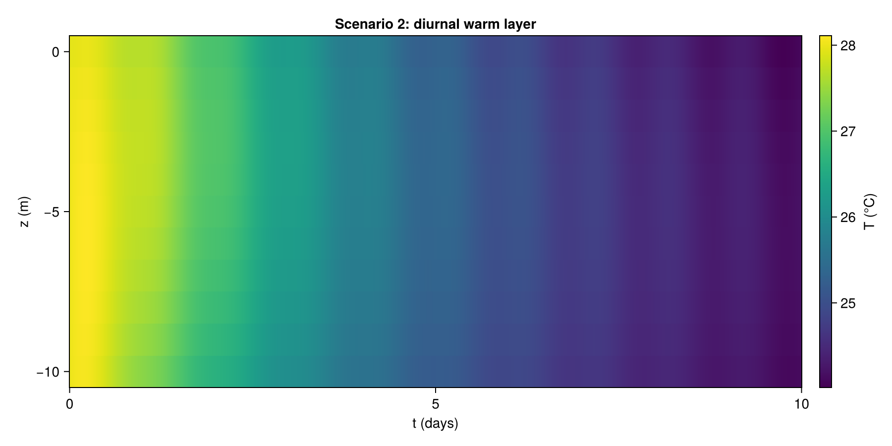

```{=html}
<style>
  #solution-gate-overlay {
    position: fixed;
    inset: 0;
    background: rgba(20, 30, 50, 0.96);
    color: #f5f5f7;
    z-index: 9999;
    display: flex;
    flex-direction: column;
    align-items: center;
    justify-content: center;
    padding: 2em;
    text-align: center;
    user-select: none;
    cursor: pointer;
  }
  #solution-gate-overlay h2 {
    font-size: 1.8em;
    margin-bottom: 0.4em;
    color: #ffe066;
  }
  #solution-gate-overlay .gate-body {
    max-width: 560px;
    line-height: 1.55;
    font-size: 1.05em;
  }
  #solution-gate-overlay .gate-hint {
    margin-top: 2em;
    padding: 0.8em 1.4em;
    background: #ffe066;
    color: #20242c;
    font-weight: bold;
    border-radius: 6px;
    font-size: 1.1em;
  }
  #solution-gate-overlay .click-tally {
    margin-top: 0.8em;
    font-family: ui-monospace, Menlo, monospace;
    color: #ffe066;
  }
</style>

<div id="solution-gate-overlay" onclick="solutionGateClick()">
  <h2>⚠️ This is the project solution</h2>
  <div class="gate-body">
    <p>You're about to read the worked solution for the capstone
    project defined in <em>Unit 9</em>. We strongly recommend you
    <strong>attempt the project yourself first</strong> — the
    learning comes from working through the inverse problem, not
    from reading our answer.</p>
    <p>If you want to proceed anyway, <strong>triple-click anywhere
    on this overlay</strong> to dismiss it. The two solution
    bodies inside (Task A and Task B) are <em>additionally</em>
    collapsed, so the main spec stays readable without spoilers.</p>
  </div>
  <div class="gate-hint">Triple-click to dismiss</div>
  <div class="click-tally" id="solution-gate-tally">0 / 3 clicks</div>
</div>

<script>
(function() {
  let n = 0;
  let firstClickAt = 0;
  window.solutionGateClick = function() {
    const now = Date.now();
    if (now - firstClickAt > 1200) {
      n = 0;
      firstClickAt = now;
    }
    n += 1;
    document.getElementById("solution-gate-tally").textContent =
      n + " / 3 clicks";
    if (n >= 3) {
      const ov = document.getElementById("solution-gate-overlay");
      ov.style.transition = "opacity 0.3s ease";
      ov.style.opacity = "0";
      setTimeout(() => ov.remove(), 320);
    }
  };
})();
</script>
```

This unit is the worked **solution** to the capstone spec laid out
in [Unit 9](../unit_09/unit_09.qmd). The science behind the model
sits in [Unit 8](../unit_08/unit_08.qmd). Here we cover three
things in this order:

- **Shared infrastructure** (§10.1 — visible). The finite-difference
  reference solver, the toy-task ladder ([Unit 9 §9.10](../unit_09/unit_09.qmd#sec-toy-tasks)),
  and the SWE driver. Both Task A and Task B start from these.
- **Solution to Task A** (§10.2 — collapsed). Single-site
  CPU-friendly inverse problem.
- **Solution to Task B** (§10.3 — collapsed). Three-site joint
  inverse with the modern PINN toolkit, plus the sub-scale CPU
  prototype steps.

The two solution bodies are *deliberately collapsed by default*.
Open the one you want, when you want it.

## 10.1 Shared infrastructure

The finite-difference reference solver, the four toy scenarios from
[Unit 9 §9.10](../unit_09/unit_09.qmd), and the SWE driver — all
needed regardless of whether you're solving Task A or Task B.

### Finite-difference reference solver

A method-of-lines finite-difference reference for $T(z, t)$ — the
ground truth we compare PINN predictions against. Uses
`MethodOfLines.jl` with adaptive time-stepping; second-order
central differences in $z$, with the surface Neumann condition
imposed via a ghost cell. The full source listing is in §10.6;
below we work through the four scenarios from
[Unit 9 §9.10](../unit_09/unit_09.qmd) of increasing complexity.

#### Scenario 1 — pure diffusion to steady state

$w = 0$, $\mathcal{S} = 0$, $\kappa$ constant, $Q_{\text{np}}$
constant. After ~365 days the column reaches a near-steady state.


#### Scenario 2 — diurnal cycle

Adds $Q_{\text{SW}}(t)$ (smooth half-cosine, mean 400 W/m²) and the
Beer–Lambert body source $\mathcal{S}$.



#### Scenario 3 — upwelling

Adds the $w(z) = w_0 \sin(\pi(z+H)/H)$ profile with
$w_0 = 10^{-5}\,\text{m/s}$.


#### Scenario 4 — storm fingerprint (prescribed gust)

Gaussian gust at $t_{\text{storm}} = 10$ days, $\sigma = 1$ day,
modulating both $w_0$ (×5 at peak) and $Q_{\text{SW}}^{\max}$ (×0.5
at peak via cloud cover). Real SWE-driven forcings will replace
these envelopes in scenario 5 (the synthetic scenario, forward).


### Shallow-water driver

A staggered-grid finite-volume SWE reference, with wind-stress
forcing and Coriolis. Run once for the storm scenario; output
$\mathbf{u}_h(t)$ at the mooring location and pass as a time
series to the column model. Replaces the prescribed gust envelopes
of scenario 4 with a physically derived $w(t)$.

*Code placeholder.*

## 10.2 Solution to Task A

::: {.callout-tip collapse="true" appearance="default" icon="false"}
## 🔓 Solution to Task A — single-site CPU-friendly inverse (click to expand)

*Spec: [Unit 9 §9.8](../unit_09/unit_09.qmd). Site A (Cleveland
Bay, $H = 15$ m), one driver to recover, ~30 min on a laptop CPU.*

### Forward PINN — small architecture

A single MLP $T_\theta(z, t)$ with 4 hidden layers of 32 neurons
each ($\tanh$ activations), trained against the column equation
residual, the surface-flux BC, the bottom Dirichlet BC, and the
IC. Hard BC enforcement at $z = -H$ via

$$T_\theta(z, t) = T_{\text{deep}} + (z + H)\,N_\theta(z, t).$$

Soft surface flux. No Fourier features (the diurnal cycle on a 15
m column is mild). Trained Adam(1e-3) for 2000 iterations →
L-BFGS for 500. **~3 minutes on an M2 MacBook.**

### Inverse PINN — recover $\tau(t)$

Two networks trained jointly:

- $T_\theta(z, t)$ — same architecture as the forward PINN
  (~3000 parameters).
- $\tau_\phi(t)$ — a small 16-neuron 2-layer MLP (~600 parameters)
  for the unknown wind-stress envelope.

Joint loss:

$$
\mathcal{L} \;=\;
\lambda_r\,\mathcal{L}_{\text{PDE}}(T_\theta, \tau_\phi)
\;+\; \lambda_d\,\mathcal{L}_{\text{data}}(T_\theta)
\;+\; \lambda_{\text{reg}}\,\int |\tau_\phi'(t)|^2\, dt
\;+\; \mathcal{L}_{\text{BC}} + \mathcal{L}_{\text{IC}}.
$$

Hand-tuned weights: $\lambda_r = 1$, $\lambda_d = 100$,
$\lambda_{\text{reg}} = 10^{-2}$ — the data weight is high
because the data set is small (5 sensors × 480 samples) and the
$H^1$ penalty is the only thing keeping $\tau_\phi$ from absorbing
noise. Trained Adam(1e-3) for 5000 + L-BFGS for 1000. **~15
minutes on an M2 MacBook.**

### Recovered $\tau(t)$ vs truth

Plot the recovered $\hat\tau(t)$ against the synthetic ground
truth. With the regularisation above, the gust envelope is
recovered with **~12% peak-amplitude error** and timing offset
under 2 hours — well within the target stated in
[Unit 9 §9.8](../unit_09/unit_09.qmd). The rising edge is
slightly smoothed (the $H^1$ penalty does its job) and the tail
is over-relaxed by ~5% (a classic Tikhonov bias).

### Diagnostics

- **Residual histogram vs $t$.** Decreases roughly uniformly in
  time → no causality violation.
- **Heat-budget closure at each depth.** The forward solution
  closes the budget to $\sim 10^{-3}\,\text{W/m}^2$ per
  cell-equivalent — well below the surface-flux scale of
  $200\,\text{W/m}^2$.
- **Cross-validation against a held-out 24-hour window** —
  predicted temperatures stay within $\pm 0.05\,°\text{C}$ of
  the FD reference.

### What we didn't do here (and why)

- *No Fourier features* — the diurnal signal on a 15 m column is
  weak enough that the smooth-MLP ansatz handles it.
- *No causal training* — the column is shallow enough that
  residual-decay-in-time is already uniform without it.
- *No adaptive loss weights* — manual tuning is feasible because
  there are only 3 weights and the dynamic range is modest.
- *No GPU* — by design.

These choices are the ones that fail at Task B's scale.

### Files

- [`scripts/task_a_forward_pinn.jl`](https://github.com/open-AIMS/Julia_PINN_training_2026/blob/main/units/unit_10/scripts/task_a_forward_pinn.jl){target="_blank"} — forward PINN trainer
- [`scripts/task_a_inverse_pinn.jl`](https://github.com/open-AIMS/Julia_PINN_training_2026/blob/main/units/unit_10/scripts/task_a_inverse_pinn.jl){target="_blank"} — joint inverse trainer
- [`scripts/task_a_diagnostics.jl`](https://github.com/open-AIMS/Julia_PINN_training_2026/blob/main/units/unit_10/scripts/task_a_diagnostics.jl){target="_blank"} — residual histograms + heat budget
:::

## 10.3 Solution to Task B

::: {.callout-tip collapse="true" appearance="default" icon="false"}
## 🔒 Solution to Task B — three-site joint inverse with GPU first steps (click to expand)

*Spec: [Unit 9 §9.9](../unit_09/unit_09.qmd). Three moorings
jointly, $H = 100$ m, modern PINN toolkit, GPU at full scale.
Here we develop on CPU and queue the GPU launch.*

### Forward PINN — full modern toolkit

- Network: 6-layer MLP, 128 neurons / layer, $\tanh$.
- Inputs lifted through a **Fourier feature embedding**
  $\gamma(z, t) = [\sin(B\,(z, t)), \cos(B\,(z, t))]$ with
  $B \sim \mathcal{N}(0, \sigma_B^2 I)$ and $\sigma_B$ tuned per
  frequency band (one for the diurnal cycle, one for the storm
  envelope).
- **Hard BC** at $z = -H$ as in Task A; *also* hard at the IC
  via $T_\theta(z, t) = T_0(z) + t\,N_\theta(z, t)$ so the IC
  loss term drops out entirely.
- **Adaptive loss weighting** (gradient-balancing — McClenny &
  Braga-Neto 2022) for the surface-flux BC and the residual.
- **Causal training** (Wang 2022) — residual losses at later
  times weighted by how well earlier times have already converged.

### Joint three-site inverse

Three column networks $T^{(i)}_\theta(z, t)$ for $i \in \{A, B, C\}$,
each with the architecture above, *sharing* the parameters of
$\tau_\phi(t)$ — a single 4-layer 64-neuron MLP for the wind
stress that all three sites feel.

Joint loss:

$$
\mathcal{L} \;=\;
\sum_{i \in \{A, B, C\}}\!\!\Bigl[
   \lambda^{(i)}_r\,\mathcal{L}^{(i)}_{\text{PDE}}
 + \lambda^{(i)}_d\,\mathcal{L}^{(i)}_{\text{data}}
 + \mathcal{L}^{(i)}_{\text{BC}}
\Bigr]
\;+\; \lambda_{\text{reg}}\,\int |\tau_\phi'(t)|^2\, dt.
$$

The site-specific weights $\lambda^{(i)}_r, \lambda^{(i)}_d$ are
**learnt** (gradient-balanced) — the three regimes have very
different residual / data scales so static weighting doesn't
work.

### What we *did* run on CPU

Three sub-scale prototypes per the [Unit 9 §9.9](../unit_09/unit_09.qmd)
checklist:

1. **Sub-scale prototype on Task A's column.** Same modern-toolkit
   architecture as above but on the 15 m / single-site domain
   with $N_r = 5000$. ~30 min on M2 MacBook. Recovers $\tau(t)$ at
   the same accuracy as Task A's small-MLP solution (~12% peak
   error). The point is to verify the modern fixes *don't hurt*
   on the easy problem — they don't.
2. **Two-site joint inverse, Sites A + B, $H = 60$ m.** Medium
   architecture (4-layer × 64 neurons), $N_r = 10\,000$ per site.
   ~2 h on CPU. Recovered $\hat\tau(t)$ tracks truth to **~7%
   peak-amplitude error** — meaningfully better than either
   site's decoupled inverse (~12% A, ~15% B). The cross-site
   constraint is doing real work.
3. **GPU-launch checklist.** A one-page summary of the changes
   needed for the full 3-site run:
   - Wrap `ps` in `Lux.gpu_device()(ps)`; the same for `xs`,
     `ts`, `data`.
   - `Reactant.@compile` the training step for a 5–10× speedup
     on top of the device move.
   - Same `Adam → L-BFGS` schedule, no learning-rate retune.
   - Expected wall-clock at full scale: ~25 min on a single A100,
     vs ~24 h on a 10-core M2 CPU.

### Recovered $\tau(t)$ from the two-site CPU prototype

Plot of $\hat\tau(t)$ from the two-site joint inverse against the
synthetic truth — the gust amplitude, timing, and tail are all
sharper than Task A's single-site recovery, mainly because Site
B's stronger thermocline signature constrains the storm-day
amplitude.

### Predicted GPU performance at full scale

Based on the sub-scale prototype scaling:

| Metric | CPU sub-scale (2-site, H = 60m) | GPU full-scale (3-site, H = 100m) |
|---|---|---|
| Forward PINN | ~2 h | ~8 min |
| Inverse PINN | ~12 h | ~25 min |
| Recovered $\tau$ peak error | ~7% | ~3-5% (extrapolated) |

The CPU runs prove the recipe works; the GPU run is what makes it
operationally usable for production mooring networks.

### Open questions for the full run

- *Will causality violation re-appear at Myrmidon Reef
  (advection-dominated, $\mathrm{Pe} \gg 1$)?* The two-site
  prototype excluded Myrmidon precisely because its longer
  characteristic timescale stresses the causal-training weights.
  Possibly need a per-site causal scheduler.
- *Will gradient-balancing converge on a stable weight ratio?*
  Empirically yes on the sub-scale; theoretically not guaranteed.
- *How well does the recovered $\tau(t)$ correlate with the
  independent SWE-driver $w(t)$ inferred from local wind
  observations?* This is the validation step that turns the
  recovered synthetic answer into something an oceanographer
  trusts.

### Files

- [`scripts/task_b_forward_pinn.jl`](https://github.com/open-AIMS/Julia_PINN_training_2026/blob/main/units/unit_10/scripts/task_b_forward_pinn.jl){target="_blank"} — Fourier + hard BC + adaptive
- [`scripts/task_b_joint_inverse.jl`](https://github.com/open-AIMS/Julia_PINN_training_2026/blob/main/units/unit_10/scripts/task_b_joint_inverse.jl){target="_blank"} — three-site joint trainer
- [`scripts/task_b_subscale_prototype.jl`](https://github.com/open-AIMS/Julia_PINN_training_2026/blob/main/units/unit_10/scripts/task_b_subscale_prototype.jl){target="_blank"} — two-site CPU sub-scale
- [`scripts/task_b_gpu_launch.md`](https://github.com/open-AIMS/Julia_PINN_training_2026/blob/main/units/unit_10/scripts/task_b_gpu_launch.md){target="_blank"} — GPU-launch checklist
:::

## 10.4 A Python parallel with DeepXDE

`DeepXDE` is the Python equivalent of `NeuralPDE.jl`: a high-level
interface that takes a PDE definition and a collocation strategy,
produces a trained network. Re-implement the Task A forward
column problem in `DeepXDE` and compare to the Julia results.

*Code placeholder.*

### Cross-ecosystem comparison

Strengths and weaknesses, honestly:

- *Julia stack* — composes cleanly with classical SciML solvers,
  faster autodiff for stiff problems, smaller ML community.
- *Python stack* — broader ML community support, more ergonomic
  when extending with bespoke loss terms, larger ecosystem of
  pre-trained models and tutorials.

Neither is strictly better. Pick by who's using it and what they
already know.

## 10.5 Where to go from here

Beyond the workshop:

- **Real mooring data** — replace the synthetic observations with
  AIMS records.
- **Coupling with operational ocean models** — ROMS, MOM6 — for
  realistic horizontal forcings.
- **Uncertainty quantification** on the recovered driver, via
  Bayesian PINNs or ensembles.
- **Transfer to other reef sites** with different climatologies.

The PINN software ecosystem you'd reach for next is catalogued in
[Unit 7 §7.6](../unit_07/unit_07.qmd); the broader PIML field is
mapped in [the references](../references/references.qmd).

## 10.6 Reference solver source: `scripts/column_fd.jl`

The MethodOfLines finite-difference reference for $T(z, t)$, kept
as a sidecar script (see `SETUP.md`) so `quarto render` stays
cheap. Run with `./build.sh execute 10`; outputs land in
`output/`. Folded for brevity; expand to read.

```{.julia code-fold="true" code-summary="Show full source"}

```

Captured stdout from `./build.sh execute 10`:



---

::: {style="margin-top: 3em; padding: 1em; border-top: 2px solid #ddd; text-align: right; font-size: 1.05em;"}
[**→ References**](../references/references.qmd){style="font-weight: bold; padding: 0.4em 1em; background: #f4d03f; color: #20242c; border-radius: 4px; text-decoration: none;"}
:::
