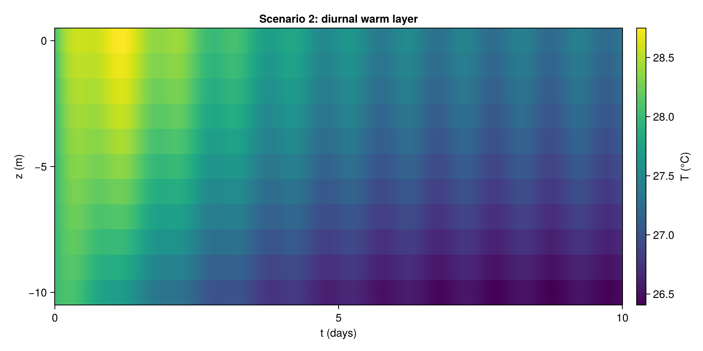
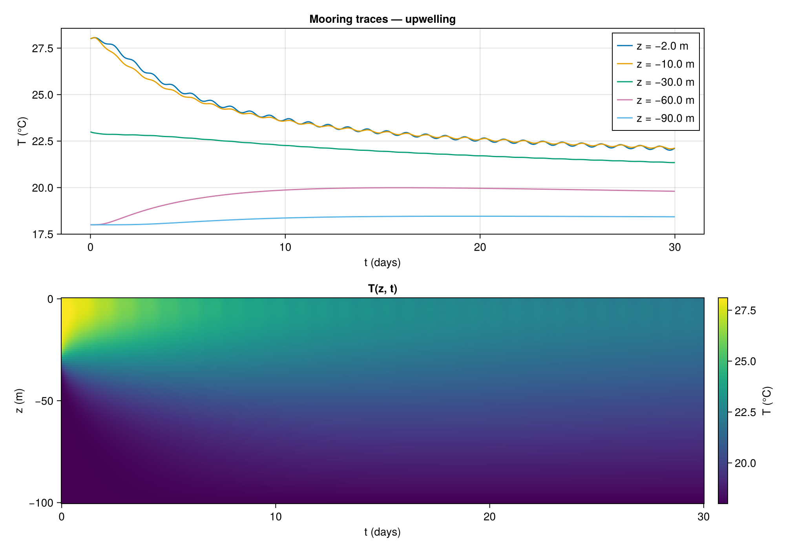

A 1D vertical heat-transport model for a stratified ocean column. The
goal of this unit is for you to *understand the model itself* — every
term, every parameter — before doing any numerics. Implementations and
experiments live in standalone `.jl` files alongside this unit.

## 11.1 Mock story

You are a fictional oceanographer at a reef site offshore from Townsville.
You have a thermistor chain moored at five depths (2 m, 10 m, 30 m, 60 m,
90 m) sampling temperature every hour for 30 days. After a storm passes,
the deeper sensors record an unexpected cooling. Three hypotheses:

1. The storm intensified **upwelling**, pumping cold water up from below.
2. The storm intensified **vertical mixing**, drawing heat away from the
   surface faster.
3. The storm caused **reduced surface heating** (cloud cover, evaporation).

You want a model simple enough to test these hypotheses against the
mooring data. The 1D column below is that model.

## 11.2 The picture

Imagine a vertical pipe of seawater, 100 m tall, sitting under the sea
surface. Heat enters from the top (sun, atmosphere). Cold water can be
pushed up from the bottom (currents elsewhere). Inside the pipe,
turbulence stirs warm and cold water together. We track only one thing:
the temperature $T$ as a function of depth $z$ and time $t$.

We ignore everything horizontal — no horizontal currents inside the pipe,
no horizontal temperature variation. One column, by itself.

## 11.3 The equation

$$
\underbrace{\frac{\partial T}{\partial t}}_{\text{(a) change in time}}
\;+\;
\underbrace{w(z,t)\,\frac{\partial T}{\partial z}}_{\text{(b) advection}}
\;=\;
\underbrace{\frac{\partial}{\partial z}\!\left(\kappa(z,t)\,\frac{\partial T}{\partial z}\right)}_{\text{(c) diffusion}}
\;+\;
\underbrace{\mathcal{S}(z,t)}_{\text{(d) sun heating}}
$$

on the domain $z \in [-H, 0]$, $t \in [0, T_f]$. With $z = 0$ at the
surface and $z = -H$ at the bottom.

### What each term means

**(a) $\partial T / \partial t$** — the rate at which temperature
changes at a *fixed depth*. Units: K/s.

**(b) Advection, $w \, \partial T / \partial z$** — vertical motion
carries temperature with it. If cold water is moving up ($w < 0$) past a
warm parcel, the parcel's temperature drops. The factor $\partial T /
\partial z$ says: this only matters where temperature varies with depth.
Units: K/s.

**(c) Diffusion, $\partial_z(\kappa \, \partial_z T)$** — turbulent
mixing smears out vertical temperature differences. Acts like a
"spreader" — it pulls heat from warm spots toward cold spots. The
strength $\kappa$ can vary with depth (more mixing near the surface, less
in the deep). Units: K/s.

**(d) Sun heating, $\mathcal{S}(z,t)$** — sunlight that *penetrates* the
water and heats each depth volumetrically (red light absorbed in the top
few cm, blue–green light reaching tens of metres). Units: K/s. Other
surface fluxes (longwave, evaporation) act *at* the surface, so they
appear in the boundary condition below, not in $\mathcal{S}$.

### Each ingredient, briefly

- **$T(z, t)$** — temperature at depth $z$, time $t$. Units: K (or °C).
- **$z$** — depth coordinate, negative downward. $z = 0$ at the sea
  surface; $z = -H$ at the bottom of the column.
- **$t$** — time, in seconds.
- **$w(z, t)$** — vertical velocity of the water itself. Negative means
  *upward* motion (since $z$ points up but is negative below the surface,
  upward water motion has $\partial z / \partial t > 0$, i.e. $w > 0$ —
  see the sign convention note below).
- **$\kappa(z, t)$** — vertical eddy diffusivity. Captures
  *unresolved* turbulent mixing as a diffusion process. Units: m²/s.
- **$\mathcal{S}(z, t)$** — volumetric heating rate from penetrating
  shortwave. Units: K/s.

::: {.callout-note}
## Sign convention for $w$

We use $w = \mathrm{d}z/\mathrm{d}t$. With $z$ measured *upward* from the
surface (so $z < 0$ inside the ocean), $w > 0$ is upward motion of water.
"Upwelling" — cold deep water rising — therefore corresponds to $w > 0$.
The advection term $w \, \partial_z T$ then has the right physical sign.
:::

## 11.4 Boundary conditions

The column has a top and a bottom; the equation needs one condition at
each.

### Top, $z = 0$: surface heat flux

$$
\kappa\,\frac{\partial T}{\partial z}\bigg|_{z=0}
\;=\; \frac{Q_{\text{np}}(t)}{\rho_0\, c_p}.
$$

In words: the downward diffusive heat flux *into* the ocean from the
air-sea interface equals the *non-penetrative* part of the surface heat
budget, divided by the volumetric heat capacity of seawater (so units
come out as K·m/s, matching $\kappa\, \partial_z T$). With $z$ measured
upward, $\partial_z T > 0$ corresponds to a warmer surface, and
$\kappa\, \partial_z T$ is the *downward* heat flux — positive
$Q_{\text{np}}$ heats the ocean by driving the surface temperature up.

- **$Q_{\text{np}}(t)$** — net non-penetrative heat flux at the surface.
  Sum of: longwave radiation, sensible heat, latent heat (evaporation).
  Units: W/m². Positive means heat *into* the ocean.
- **$\rho_0$** — reference seawater density, $\approx 1025\,\text{kg/m}^3$.
- **$c_p$** — specific heat of seawater, $\approx 4000\,\text{J/(kg·K)}$.

The penetrating shortwave $Q_{\text{SW}}$ is *not* in this BC — it lives
inside $\mathcal{S}(z, t)$ as a body source instead.

### Bottom, $z = -H$: cold reservoir

$$
T(-H, t) \;=\; T_{\text{deep}}.
$$

The water below the column is assumed to be a fixed-temperature reservoir
(deep ocean below the thermocline). Alternative: zero-flux,
$\partial_z T |_{-H} = 0$, if you prefer an insulating floor.

### Initial condition

$$
T(z, 0) \;=\; T_0(z).
$$

A smooth profile with warm surface, cold deep, and a thermocline in
between — for example,

$$
T_0(z) = \tfrac12 (T_{\text{surface}} + T_{\text{deep}})
       + \tfrac12 (T_{\text{surface}} - T_{\text{deep}})\,
         \tanh\!\bigl((z - z_t)/\delta_t\bigr),
$$

where $z_t \approx -30\,\text{m}$ sits the thermocline at 30 m depth and
$\delta_t \approx 5\,\text{m}$ sets its sharpness.

## 11.5 The forcing functions

### Surface heat flux

A minimal diurnal model:

$$
Q_{\text{SW}}(t) \;=\; Q_{\text{SW}}^{\max}\,
  \max\!\bigl(0,\, \cos(2\pi t / \tau_d)\bigr),
\qquad
Q_{\text{np}}(t) \;=\; -\,Q_{\text{cool}}.
$$

- **$\tau_d = 86400\,\text{s}$** — one day.
- **$Q_{\text{SW}}^{\max}$** — peak noon shortwave (e.g. $800\,\text{W/m}^2$).
- **$Q_{\text{cool}}$** — steady net cooling from longwave + evaporation
  (e.g. $200\,\text{W/m}^2$).

### Penetrating shortwave (the body source)

Sunlight is absorbed exponentially with depth (Beer–Lambert):

$$
I(z, t) \;=\; Q_{\text{SW}}(t)\,e^{z/\zeta},
\qquad
\mathcal{S}(z, t) \;=\; \frac{1}{\rho_0\, c_p}\,\frac{\partial I}{\partial z}.
$$

- **$\zeta$** — light penetration scale (e.g. $\zeta \approx 10\,\text{m}$
  for a single-band model; refined two-band Paulson–Simpson splits this
  into a 0.35 m red band and a 23 m blue–green band).

### Vertical velocity (upwelling)

Prescribe a simple profile pinned to zero at top and bottom:

$$
w(z) \;=\; w_0\, \sin\!\bigl(\pi\,(z+H)/H\bigr),
$$

with $w_0 > 0$ giving upward motion. A typical magnitude is
$w_0 \sim 10^{-5}\,\text{m/s}$, i.e. about 1 m/day.

### Eddy diffusivity

Three closures in increasing realism (pick one per experiment):

1. **Constant**: $\kappa = \kappa_0$.
2. **Profile**: $\kappa(z) = \kappa_b + (\kappa_m - \kappa_b)\,e^{z/h_m}$
   — large near the surface (mixed layer of scale $h_m$), small at depth.
3. **Stratification-dependent**:
   $\kappa(z, t) = \kappa_b + \kappa_0 / (1 + 5\,\mathrm{Ri})^2$,
   with the Richardson number $\mathrm{Ri} = N^2 / (\partial_z U)^2$,
   buoyancy frequency $N^2 = \alpha g\, \partial_z T$, and a prescribed
   shear $\partial_z U$. Mixing is suppressed in stably stratified water.

## 11.6 Reference parameter values

| Symbol | Value | Units | Meaning |
|---|---|---|---|
| $H$ | 100 | m | column depth |
| $T_f$ | 30 days | s | simulation horizon |
| $\rho_0$ | 1025 | kg/m³ | seawater density |
| $c_p$ | 4000 | J/(kg·K) | specific heat |
| $\alpha$ | $2\!\times\!10^{-4}$ | 1/K | thermal expansion |
| $T_{\text{surface}}$ | 28 | °C | initial SST |
| $T_{\text{deep}}$ | 18 | °C | deep reservoir |
| $z_t,\, \delta_t$ | $-30$, 5 | m | thermocline depth, width |
| $Q_{\text{SW}}^{\max}$ | 800 | W/m² | peak noon SW |
| $Q_{\text{cool}}$ | 200 | W/m² | non-penetrative net cooling |
| $\zeta$ | 10 | m | shortwave penetration scale |
| $\kappa_b$ | $10^{-5}$ | m²/s | background diffusivity |
| $\kappa_m$ | $10^{-3}$ | m²/s | mixed-layer diffusivity |
| $h_m$ | 20 | m | mixed-layer scale |
| $w_0$ | $10^{-5}$ | m/s | peak upwelling (~1 m/day) |

## 11.7 Useful dimensionless groups

- **Péclet number**, $\mathrm{Pe} = w_0 H / \kappa_m$ — advection vs.
  diffusion. With the values above, $\mathrm{Pe} \approx 1$ (balanced).
- **Diffusive time scale**, $T_\kappa = H^2 / \kappa_m \approx 10^7\,\text{s}
  \approx 116\,\text{days}$ — how long it takes diffusion to mix the full
  column.
- **Diurnal-to-diffusive ratio**, $\tau_d / T_\kappa \sim 10^{-2}$ — the
  daily cycle is much faster than bulk diffusion, so it lives in a thin
  near-surface layer.

## 11.8 Toy tasks (to be done in `.jl` files)

In order of increasing complexity. Each builds on the previous.

1. **Pure diffusion, steady forcing.** Set $w = 0$, $\mathcal{S} = 0$,
   $\kappa$ constant, $Q_{\text{np}} = $ constant. Solve to steady state.
   *Expected:* a linear $T(z)$ profile balancing surface flux against the
   deep reservoir. Sanity check: analytic solution exists.

   

2. **Add the diurnal cycle.** Turn on the time-varying $Q_{\text{SW}}(t)$
   and the body source $\mathcal{S}$. Keep $w = 0$, $\kappa$ constant.
   *Expected:* a diurnal warm layer in the top few metres that warms in
   the afternoon and erodes overnight. Bulk profile barely changes over
   30 days.

   

3. **Add upwelling.** Turn on $w(z)$ with $w_0 = 10^{-5}\,\text{m/s}$.
   *Expected:* cold water from depth invades the bulk; SST drops slowly
   over weeks. The diurnal warm layer survives but sits on top of cooler
   water.

   

4. **Vary mixing.** Switch $\kappa$ from constant to the profile closure
   with mixed-layer scale $h_m$. Try $h_m = 5, 20, 50$ m. *Expected:*
   deeper mixed layer $\Rightarrow$ thicker but cooler warm layer at the
   surface, smoother thermocline.

5. **The mock story, forward.** Run a *single* wind event in the 2D
   shallow-water model (§11.10) — a Gaussian gust passing over the
   mooring on day 10, lasting 3 days. Read off the time series $w(t)$,
   $|\boldsymbol{\tau}|(t)$, and $Q_{\text{SW}}^{\max}(t)$ (cloud cover
   tied to the gust) at the mooring location, and feed them into the 1D
   column. Plot temperature traces at the five mooring depths.
   *Expected:* deeper sensors cool first (upwelling fingerprint),
   surface stays close to baseline because cloud and stress cancel.
   Compare to "decoupled" runs that perturb only one driver at a time.

   

6. **The mock story, inverse.** Generate synthetic mooring data from the
   forward scenario above with added noise
   ($\sigma = 0.05\,°\text{C}$). Hand the data to a PINN that knows the
   PDE structure of the 1D column and treats *one* wind-driven forcing
   as unknown — for example, the time series of stress amplitude
   $|\boldsymbol{\tau}|(t)$, which sets both $w(t)$ via Ekman pumping
   and $\kappa_m(t)$ via a wind-mixing closure. *Expected:* the PINN
   recovers the wind-event envelope from temperature data alone.

## 11.9 Notebook-vs-code split

This `.qmd` is the model document. Implementations live as sidecar
scripts under `units/unit_11/scripts/` (kept out of the Quarto render
so iteration is fast — see `SETUP.md`). Run them with
`./build.sh execute 11`; outputs land in `units/unit_11/output/`
and are embedded back into this page.

- `scripts/column_fd.jl` — `MethodOfLines.jl` finite-difference reference solver.
- `scripts/column_pinn_forward.jl` — PINN for the forward problem *(TODO)*.
- `scripts/column_pinn_inverse.jl` — inverse PINN for one unknown function *(TODO)*.
- `scripts/mock_story.jl` — driver script that runs scenarios 5 and 6 *(TODO)*.

## 11.10 Reference solver: `scripts/column_fd.jl`

The MethodOfLines finite-difference reference for $T(z, t)$ — the
ground truth we'll compare PINN predictions against. Folded for
brevity; expand to read.

```{.julia code-fold="true" code-summary="Show full source"}

```

Captured stdout from `./build.sh execute 11`:


